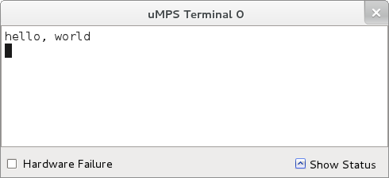

# Getting started with µMPS

## Introduction

Writing your own programs (i.e. a simple operating system) for a bare machine such as µMPS is not necessarily very hard, but the task is in certain respects inherently different from that of writing programs for a "hosted" environment.
The purpose of this guide is to give you a panoramic view of the µMPS programming environment, and thus help you avoid getting lost in the many pages of the available documentation.
That being said, this short guide is *not* a substitute for the longer, official, documents.

## Installation and Package Overview

The obvious first step is to get µMPS3 up and running on your system.
See the [Installation](installation.md) page for information on obtaining and installing µMPS3.

What does the µMPS3 package consist of?
Besides the emulator (`umps3`), several other components are distributed and installed with µMPS3:

### Bootstrap and execution ROM (also known as the *BIOS*) images

The bootstrap ROM contains the boot loader, which loads your operating system into RAM, performs necessary initializations, and finally transfers control to the OS.

The execution ROM contains the core, low-level, exception handling code and exposes a higher-level exception handling interface to the OS. In practice, this means you don't need to write exception handling code in assembly and you can enjoy the comfort of the C language.

### Object file support tools

The following tools, which run on the host system, are provided:

- `umps3-elf2umps`:
This tool is used to convert files in the ELF format to files in a native µMPS format.
- `umps3-objdump`:
This tool is used to inspect files in the µMPS *.aout* or *.core* object formats.
- `umps3-mkdev`:
This tool is used to create the files that represent disk and flash devices.

### Target utility library, startup modules, and headers

These components are provided to simplify the task of writing programs for µMPS.
As an example, it usually possible to write all your code in C when using them, making familiarity with MIPS assembly optional.

The utility library, called `libumps`, allows you to conveniently invoke BIOS services from C, access coprocessor registers, and issue coprocessor instructions.

The header files contain useful definitions, such as register map definitions for various device and machine registers, that can save you time and debugging effort.

## Toolchain

Since you will hopefully be writing your programs in C, you will need a compiler that supports our target platform.
Your *host compiler* cannot be used for this purpose, as it will generally support a processor architecture different from the target one ([MIPS-I](https://www.linux-mips.org/wiki/Instruction_Set_Architecture#MIPS_I)).
Instead, to compile programs for µMPS you will need to use a separate compiler, called a *cross compiler*.
More generally, we refer to the cross compiler and the associated set of programming tools as a *cross toolchain*.
Thus, the build environment for µMPS programs will run on your *host system*, and will consist of a cross [GNU toolchain](https://en.wikipedia.org/wiki/GNU_toolchain) and the µMPS object file utilities.

### Object File Formats

The cross GNU toolchain we use is configured for an [ELF](https://en.wikipedia.org/wiki/Executable_and_Linkable_Format) target, the standard object file format on virtually all modern Unix-like systems.
While very flexible, ELF requires somewhat complex runtime support.
For this reason, µMPS comes with support for simplified object file formats, based on the original Unix [a.out](https://en.wikipedia.org/wiki/A.out) format.
Two variations of the executable file format are provided: the *.aout* format is used for regular executables (i.e. "userland") while the *.core* file format is used for kernel images.

### Installing the Toolchain

Before moving on, you need a working µMPS cross toolchain.
You should already have installed one during the [Installation](installation.md) phase.
Previously, in older versions of µMPS, the toolchain had to be built from source. [PDF](http://mps.sourceforge.net/pdf/umps-cross-toolchain-guide.pdf) [obsolete]

## Booting in µMPS

Unless you are writing a program that can reside entirely in read-only memory (ROM), your program (i.e. the operating system) must somehow be loaded into RAM — typically from secondary storage — before much can happen.
Since writing a boot loader is a non-trivial task for the inexperienced programmer, this would cause a major hurdle; µMPS offers a solution for this problem, freeing you from having to write your own loader: the `coreboot.rom.umps` bootstrap ROM allows you to have the OS (i.e. the .core image) already preloaded in RAM on boot.

## Hello World

Now that the emulator and the toolchain are installed, we are ready to compile and run a sample program.
Following tradition, the program prints the venerable "hello, world" message on a µMPS terminal.

~~Download the example program~~

*work in progress*

### Running the Program

To run the above example you need to create a new machine.
This is performed using the GUI and is easy enough that it should require little explanation: simply create a new machine configuration (giving it any name you like) in the directory where the example program resides.

As it turns out, we do not need to change any settings as the defaults are exactly what we want: the only installed device is terminal 0, the core file is preloaded in RAM, and the bootstrap ROM is `coreboot.rom.umps`.

You can now power on the machine and start it; the greeting message should appear in the terminal 0 window:

## Further Reading

The µMPS3 machine architecture is described in *µMPS3 Principles of Operation* (see the [Documentation](../../umps.md#Documentation) section).
The previous editions of that book described earlier revisions of the architecture.

There are times when you may want or need to program in MIPS assembly language, such as when writing low-level exception handling code, or when learning assembly programming for it's own sake.
In such cases, you will need a reference on MIPS architecture and assembly language, of which there are plenty.
One of the standard texts is *MIPS RISC Architecture* by Garry Kane (Prentice Hall, Englewood Cliffs, NJ 07637; ISBN: 0-13-584293-X).
