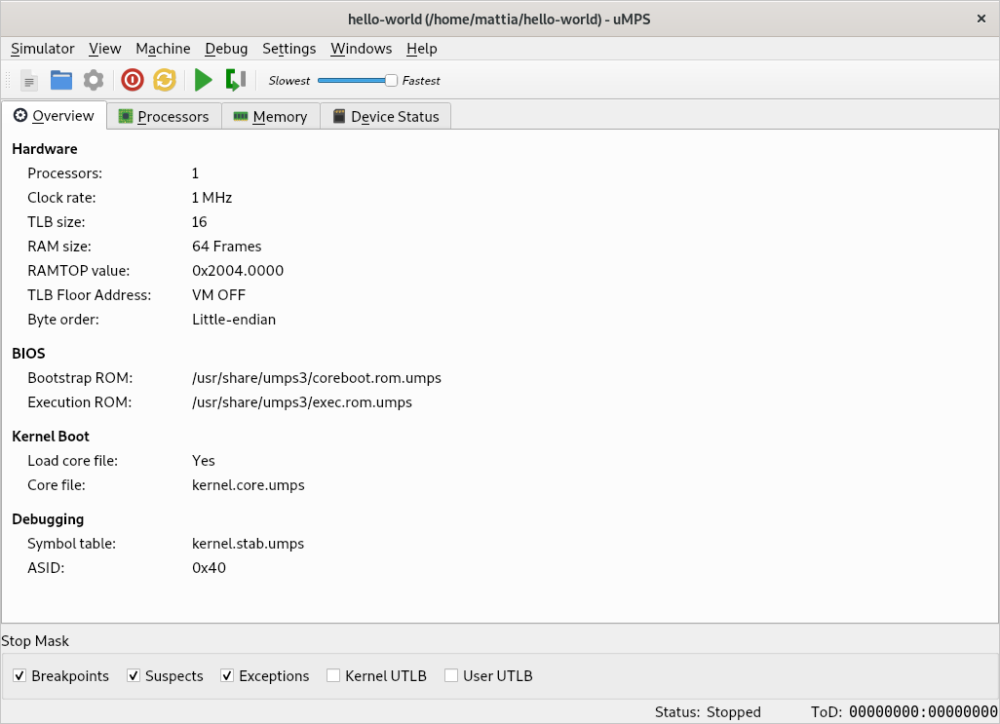
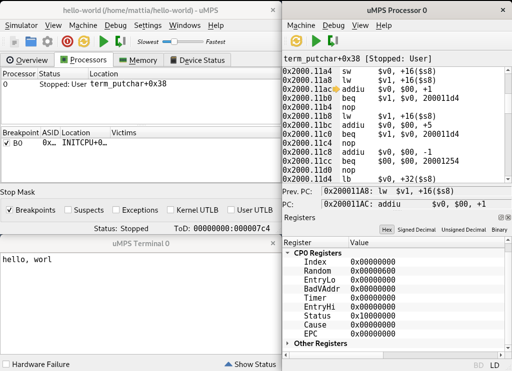
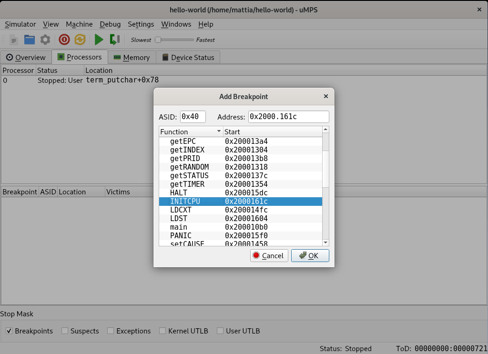

# µMPS

## What is µMPS?

µMPS is an educational computer system architecture and an accompanying emulator designed from the ground up to achieve the right trade-off between simplicity and elegance on one side, and realism on the other.
This makes µMPS ideally suited for use in education, such as hands-on operating systems or computer architecture university courses.

The µMPS processor implements the MIPS I instruction set, and can therefore be supported out of the box by existing MIPS compilers.
The architecture details a complete set of I/O devices (terminals, disks, flash devices, printers, and network adapters) that feature a clean, consistent, programming interface.

The emulator comes with built-in debugging features and an easy to use graphical user interface.
Apart from the emulator itself, several support utilities are provided that can get you quickly started in developing programs for µMPS.

µMPS is now in its third iteration: µMPS3.
Due to the pedagogically driven changes implemented in µMPS3, this latest version is **NOT** backward compatible with either µMPS2 or µMPS(1).
All references to µMPS on these VirtualSquare/µMPS web pages are to the current version, µMPS3, unless explicitly stated.

µMPS3 is free software, licensed under the [GNU General Public License, version 3](https://www.gnu.org/licenses/gpl-3.0.html).

µMPS3 is available on GitHub at [https://github.com/virtualsquare/umps3](https://github.com/virtualsquare/umps3).

---

## Features

### Architecture Features

- **MIPS CPU**:
The µMPS integer instruction set is a strict superset of MIPS I.
The extensions include a *wait for interrupt* instruction (a must for every modern instruction set) and [read-modify-write](https://en.wikipedia.org/wiki/Read-modify-write) primitives.
While fully compatible at the ISA level with real implementations of MIPS I (R2000/R3000), µMPS somewhat differs from those in the coprocessor interface. Compared to R2000/R3000 CPUs, µMPS provides simplified virtual memory management.
- **Multiprocessor support**:
The µMPS architecture includes (shared memory) multiprocessor support.
The multiprocessor hardware interface was designed to cater simple and sophisticated uses alike; it is simple to use for programmers who only need basic multiprocessor support, but also provides advanced features (such as fine grained interrupt distribution control) for systems that require them.
Up to 16 processors are supported by the architecture.
- **Peripheral devices**:
µMPS supports the following hardware devices: disks, flash devices, terminals, network interfaces, and printers.
The different device controllers have a simple and consistent memory-mapped I/O interface.
Devices are backed by regular files by the emulator and non-volatile memory can be retained between emulation runs.

### Emulator Features

- **Graphical user interface**:
The µMPS emulator comes with a modern, easy to use graphical user interface, built using the [Qt framework](https://www.qt.io/).
All user interactions with the emulator, from configuration of the emulated machine to debugging, are performed using the GUI.
- **Built-in debugging features**:
µMPS also comes with built in debugging support.
Most of the features you have come to expect from a debugger are present: breakpoints, memory traces, watchpoints, and a code disassembly view.
Memory content from arbitrary memory regions can be displayed in hexadecimal representation and edited in-place.

---

## Screenshots

  

---
## Tutorials

- [How to install µMPS3](tutorials/umps/installation.md)
- [How to get started using µMPS3](tutorials/umps/getting_started.md)
- [Debugging features of µMPS3](tutorials/umps/debugging.md)

---

## µMPS Versus Related Systems

### µMPS versus simple MIPS processor simulators

We believe µMPS can be a replacement for the simple assembly source-level MIPS processor simulators, such as [SPIM](http://spimsimulator.sourceforge.net/) or [MARS](https://courses.missouristate.edu/KenVollmar/MARS/), that are widely used in introductory computer architecture or similar courses that include an assembly programming component.
There are, nonetheless, striking differences between these and µMPS:

- Programs such as SPIM and MARS simulate the execution of MIPS programs by interpreting some variant of MIPS assembly language. By contrast, µMPS executes actual MIPS machine code.
- µMPS emulates a complete computer system, as opposed to the above systems which only simulate a processor, and possibly a console device with an ad-hoc syscall interface.

Note that, compared to simulators such as SPIM and MARS, programming for µMPS is somewhat more complex.
The learning curve is not very steep, however, and there is plenty of [documentation](#Documentation) and [tutorials](#Tutorials) to guide you.

### µMPS versus other full system emulators

Emulators such as QEMU emulate real computer systems, including their complexities.
µMPS, on the other hand, was conceived primarily as a pedagogical tool and its architecture can be seen as an idealized and simplified version of existing ones.
Also, because these emulators are meant to efficiently run real-world operating systems, they put first and foremost an emphasis on performance, at the cost of code complexity.
The µMPS code base is, by comparison, significantly less complex and is approachable by less experienced programmers.

---

## History, Credits, and Acknowledgments

The µMPS project has a long history.
The direct predecessor of µMPS was MPS, developed at the Computer Science department of the University of Bologna by Mauro Morsiani, under the supervision of Renzo Davoli.
MPS, like its descendants, is a full system emulator: it emulates a computer system comprising a single processor, a bus, and a set of peripheral devices. The emulated processor is a R2000/R3000, the original 32-bit MIPS (retrospectively MIPS I) CPU.
The emulator featured a graphical user interface, implemented using the XForms toolkit, and built-in debugging functionality.

MPS was in turn inspired by CHIP (Cornell Hypothetical Instructional Processor) and the accompanying HOCA operating system project.
CHIP/HOCA were used before the adoption of MPS/µMPS in the operating systems lab course at the University of Bologna, to which they were brought by Ozalp Babaoglu.

µMPS was an evolution of the original MPS project.
Its design was based on experience with MPS in undergraduate operating systems courses taught by Renzo Davoli (University of Bologna) and Michael Goldweber (Xavier University).
The architecture replaced the relatively complex virtual memory management subsytem of the R3000 processor with a streamlined one, easier to comprehend and program.

Tomislav Jonjic extended the architecture with multiprocessor support, redesigned the user interface and reimplemented it using the Qt framework, releasing the second version of the project: µMPS2

Mattia Biondi updated µMPS2 to µMPS3 and took over the project maintainance.
This third release, the one implemented by the current version of the emulator, brought significant changes to the whole emulator:

- The complexity of the architecture has been simplified (memory management, exception handling, processor initialization)
- Tape devices have been replaced by a new class of flash devices
- The project building process migrated from the GNU Autotools to CMake
- The graphical user interface has been updated from Qt4 to Qt5 and slightly modified

The authoritative reference on µMPS(2/3), *µMPS(2/3) Principles of Operation*, was written by Michael Goldweber and Renzo Davoli.

In addition to the implicit acknowledgments we have given above, the authors would also like to thank the numerous students who have assisted the project by testing it and by giving valuable suggestions.

---

## Documentation

### Books

- Michael Goldweber, Renzo Davoli, [*µMPS3 Principles of Operation*, Lulu Books](https://www.lulu.com/en/us/shop/renzo-davoli-and-michael-goldweber/%CE%BCmps3-principles-of-operation/paperback/product-6jvqn4.html), 2020 [PDF](doc/uMPS3princOfOperations.pdf) ([Amazon](https://www.amazon.com/%C2%B5MPS3-Principles-Operation-Michael-Goldweber/dp/1716476402/))

This book is the definitive reference on the µMPS3 architecture.
It represents an update to the µMPS architecture defined in earlier editions of this work, titled *µMPS Principles of Operation* and *µMPS2 Principles of Operation*.

- Michael Goldweber, Renzo Davoli, [*Student Guide to the Pandos Project*, Lulu Books](https://www.lulu.com/en/us/shop/renzo-davoli-and-michael-goldweber/student-guide-to-the-pandos-project/paperback/product-n6j96y.html), 2020 [PDF](doc/pandos.pdf) ([Amazon](https://www.amazon.com/Student-Pandos-Project-Michael-Goldweber/dp/171631559X/))

### Articles and Papers

- M. Morsiani, R. Davoli, [*Learning Operating Systems Structure and Implementation through the MPS Computer System Simulator*](https://dl.acm.org/doi/10.1145/299649.299683), in *The Proceedings of the Thirtieth SIGCSE Technical Symposium on Computer Science Education*, SIGCSE '99, (New York, NY, USA), pp. 63–67, ACM, March 1999. [PDF](http://mps.sourceforge.net/pdf/MPSpaper.pdf)
- Michael Goldweber, Renzo Davoli, Mauro Morsiani, [*The Kaya OS Project and the µMPS Hardware Emulator*](https://dl.acm.org/doi/10.1145/1067445.1067462), in *Proceedings of the 10th Annual SIGCSE Conference on Innovation and Technology in Computer Science Education*, ITiCSE '05, (New York, NY, USA), pp. 49–53, ACM, June 2005. [PDF](http://mps.sourceforge.net/pdf/uMPSpaper.pdf)
- M. Goldweber, R. Davoli, [*Virtual square (V^2) in Computer Science Education*](https://dl.acm.org/doi/10.1145/1067445.1067528), in *Proceedings of the 10th Annual SIGCSE Conference on Innovation and Technology in Computer Science Education*, ITiCSE '05, (New York, NY, USA), pp. 301–305, ACM, June 2005.
- M. Goldweber, R. Davoli, and T. Jonjic, [*Supporting Operating Systems Projects Using the µMPS2 Hardware Simulator*](https://dl.acm.org/doi/10.1145/2325296.2325315), in *Proceedings of the 17th ACM Annual Conference on Innovation and Technology in Computer Science Education*, ITiCSE '12, (New York, NY, USA), pp. 63–68, ACM, July 2012.
- M. Goldweber, R. Davoli, M. Biondi, *The Pandos Project and the μMPS3 Emulator*, in *Proceedings of the 26th Annual Conference on Innovation and Technology in Computer Science Education*, ITiCSE '21.

### Theses

- Tomislav Jonjic, *Design and Implementation of the uMPS2 Educational Emulator*, November 2012. [PDF](https://amslaurea.unibo.it/4472)
- Mattia Biondi, *An Updated Emulated Architecture to Support the Study of Operating Systems*, May 2020. [PDF](https://amslaurea.unibo.it/20751/)

### Historical documentation

#### How-Tos

- Tomislav Jonjic, *µMPS2 Cross Toolchain Guide*, September 2011. [PDF](http://mps.sourceforge.net/pdf/umps-cross-toolchain-guide.pdf) [obsolete]
