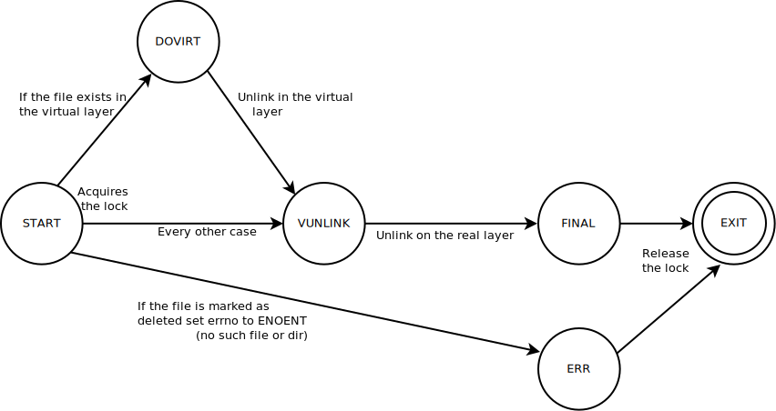

# `vufs`: Virtual File Systems in VUOS  

---

## Overview  
The Virtual File System (VUFS) provides a mechanism for virtualizing file system operations within the VUOS project. It implements a layered approach to managing file operations based on the mounting mode such as **binding**, **merging**, **copy-on-write (COW)**, and **minimal COW** through an use of automata to manage the various states of operations.  
For more information about the differences of the mounting modes and how they work check out [the tutorial](../tutorials/vufs.md).

---

## Key Components  

### Core Structure and Support Functions  
- **`struct vufs_t`**: The structure represents the state of a virtual file system.
  - It includes file descriptors (`vdirfd`, `rdirfd`, `ddirfd`), mutex for thread safety, and flags.
- **`vufs_lock` and `vufs_unlock`**: Thread safety mechanisms wrapping `pthread_mutex` (semaphore based) operations.

---

### File Existence and Deletion Functions  
- **`vufs_vexist`**: Check if a file exists in the virtual file system (`vdirfd`).
- **`vufs_rexist`**: Check if a file exists in the real file system (`rdirfd`).
- **`vufs_vdeleted`**: Determine if a file has been deleted or is inaccessible in the virtual layer.

---

## File System Actions States  

1. **`VUFSA_START`**: Initialize the operation (usually acquire the lock)  
2. **`VUFSA_DOVIRT`**: Operate on the virtual layer.  
3. **`VUFSA_DOREAL`**: Operate on the real layer.  
4. **`VUFSA_DOCOPY`**: Copy file contents for COW.  
5. **`VUFSA_VUNLINK`**: Virtually unlink the file.  
6. **`VUFSA_FINAL`**: End the operation successfully.  
7. **`VUFSA_ERR`**: Handle errors.  
8. **`VUFSA_EXIT`**: Exit state (release the lock when it was acquired).

---

### Implement Action Functions
1. **Read-Only Operations (`vufsa_rdonly`)**:  
   - Prioritize the virtual layer.  
   - Fallback to the real layer if the file is missing.  
   
2. **Bind Files (`vufsa_bind`)**:  
   - Map real files directly into the virtual file system.  

3. **Merge Files (`vufsa_merge` & `vufsa_merge_unlink`)**:  
   - Overlay virtual files on the real file system.  
   - Ensure modifications are prevented in the read-only virtual layer.  

4. **Copy-on-Write (COW) Operations**:  
   - Use `vufsa_cow` to isolate file modifications.  
   - Implement file creation in COW mode with `vufsa_cow_creat`.  
   - Handle file deletion using `vufsa_cow_unlink`.  

5. **Minimal COW (MINCOW) Operations**:  
   - Use `vufsa_mincow` to avoid unnecessary copying.  
   - Create files using `vufsa_mincow_creat`.  
   - Manage deletions with `vufsa_mincow_unlink`.  

---

### Selector Function: `vufsa_select`  
1. Determine the appropriate action based on file system type and operation flags:  
   - Use `VUFS_BIND`, `VUFS_MERGE`, `VUFS_COW`, or `VUFS_MINCOW`.  
   - Match file operation flags (e.g., `O_RDONLY`, `O_CREAT | O_EXCL`).  

---

### Handle Errors with Standard Codes
   - `ENOENT`: File not found.  
   - `EROFS`: Read-only file system error.  
   - `EEXIST`: File already exists.  
   - `EACCES`, `EPERM`: Permission errors.

---

## Automata Descriptions  

This section describes the automata managing file system operations in the Virtual File System (VUFS). Each automaton follows a consistent format, listing actions, conditions, and transitions between states.

---

### **1. `vufsa_rdonly`**  
**Purpose**: Handle read-only file operations, preferring the virtual layer and falling back to the real layer if needed.

#### **States and Transitions**  
1. **`VUFSA_START`**:  
   - **Action**: Lock the virtual file system (`vufs`).  
   - **Next**: `VUFSA_DOVIRT`.  

2. **`VUFSA_DOVIRT`**:  
   - **Conditions**:  
     - **File Not Found (`errno == ENOENT`)**:  
       - **File Deleted (`vufs_vdeleted`)** → Go to `VUFSA_FINAL` (`errno = ENOENT`).  
       - **File Not Deleted** → Move to `VUFSA_DOREAL`.  
     - **File Exists** → Proceed to `VUFSA_FINAL`.  

3. **`VUFSA_DOREAL`**:  
   - **Action**: Try accessing the file in the real file system.  
   - **Next**: `VUFSA_FINAL`.  

4. **`VUFSA_FINAL` / `VUFSA_ERR`**:  
   - **Action**: Unlock the file system and finalize the operation.  
   - **Next**: `VUFSA_EXIT`.  

---

### **2. `vufsa_bind`**  
**Purpose**: Map real files directly into the virtual space.

#### **States and Transitions**  
1. **`VUFSA_START`**:  
   - **Next**: `VUFSA_DOVIRT`.  

2. **`VUFSA_DOVIRT` / `VUFSA_ERR`**:  
   - **Next**: `VUFSA_EXIT`.  

---

### **3. `vufsa_merge`**  
**Purpose**: Manage merging by overlaying the virtual layer on top of the real file system with read-only semantics.

#### **States and Transitions**  
1. **`VUFSA_START`**:  
   - **Action**: Lock `vufs`.  
   - **Conditions**:  
     - **File Exists in Virtual Layer or Deleted (`vufs_vexist` / `vufs_vdeleted`)**:  
       - Set `errno = EROFS`.  
       - **Next**: `VUFSA_ERR`.  
     - **File Not Found** → Go to `VUFSA_DOREAL`.  

2. **`VUFSA_DOREAL`**:  
   - **Action**: Operate on the real file system.  
   - **Next**: `VUFSA_FINAL`.  

3. **`VUFSA_FINAL` / `VUFSA_ERR`**:  
   - **Action**: Unlock `vufs`.  
   - **Next**: `VUFSA_EXIT`.  

---

### **4. `vufsa_merge_unlink`**  
**Purpose**: Handle unlinking files in the merging setup.

#### **States and Transitions**  
1. **`VUFSA_START`**:  
   - **Action**: Lock `vufs`.  
   - **Conditions**:  
     - **File Exists in Virtual Layer (`vufs_vexist`)** → Go to `VUFSA_ERR` (`errno = EROFS`).  
     - **File Deleted (`vufs_vdeleted`)** → Proceed to `VUFSA_ERR` (`errno = ENOENT`).  
     - **Otherwise** → Move to `VUFSA_DOREAL`.  

2. **`VUFSA_DOREAL`**:  
   - **Next**: `VUFSA_FINAL`.  

3. **`VUFSA_FINAL` / `VUFSA_ERR`**:  
   - **Action**: Unlock `vufs`.  
   - **Next**: `VUFSA_EXIT`.  

---

### **5. `vufsa_cow`**  
**Purpose**: Implement Copy-on-Write (COW) operations.

#### **States and Transitions**  
1. **`VUFSA_START`**:  
   - **Action**: Lock `vufs`.  
   - **Conditions**:  
     - **File Exists in Virtual Layer or Deleted (`vufs_vexist` / `vufs_vdeleted`)** → Move to `VUFSA_DOVIRT`.  
     - **Otherwise** → Proceed to `VUFSA_DOCOPY`.  

2. **`VUFSA_DOCOPY`**:  
   - **Next**: `VUFSA_DOVIRT`.  

3. **`VUFSA_DOVIRT`**:  
   - **Next**: `VUFSA_FINAL`.  

4. **`VUFSA_FINAL` / `VUFSA_ERR`**:  
   - **Action**: Unlock `vufs`.  
   - **Next**: `VUFSA_EXIT`.  

---

### **6. `vufsa_cow_creat`**  
**Purpose**: Handle file creation under COW semantics.  

#### **States and Transitions**  
1. **`VUFSA_START`**:  
   - **Action**: Lock `vufs`.  
   - **Conditions**:  
     - **File Exists in Real Layer and Not Deleted (`vufs_rexist`)** → Proceed to `VUFSA_ERR` (`errno = EEXIST`).  
     - **Otherwise** → Go to `VUFSA_DOVIRT`.  

2. **`VUFSA_DOVIRT`**:  
   - **Next**: `VUFSA_FINAL`.  

3. **`VUFSA_FINAL` / `VUFSA_ERR`**:  
   - **Action**: Unlock `vufs`.  
   - **Next**: `VUFSA_EXIT`.  

---

### **7. `vufsa_cow_unlink`**  
**Purpose**: Manage file deletion under COW semantics.

#### **States and Transitions**  
1. **`VUFSA_START`**:  
   - **Action**: Lock `vufs`.  
   - **Conditions**:  
     - **File Exists in Virtual Layer (`vufs_vexist`)** → Move to `VUFSA_DOVIRT`.  
     - **File Deleted (`vufs_vdeleted`)** → Proceed to `VUFSA_ERR` (`errno = ENOENT`).  
     - **File Exists in Real Layer (`vufs_rexist`)** → Go to `VUFSA_VUNLINK`.  
     - **Otherwise** → Set `errno = ENOENT` and go to `VUFSA_ERR`.  

2. **`VUFSA_DOVIRT`**:  
   - **Next**:  
     - **File Exists in Real Layer and Not Deleted (`vufs_rexist`)** → Proceed to `VUFSA_VUNLINK`.  
     - **Otherwise** → Move to `VUFSA_FINAL`.  

3. **`VUFSA_VUNLINK`**:  
   - **Next**: `VUFSA_FINAL`.  

4. **`VUFSA_FINAL` / `VUFSA_ERR`**:  
   - **Action**: Unlock `vufs`.  
   - **Next**: `VUFSA_EXIT`.  

---

### **8. `vufsa_mincow`**  
**Purpose**: Optimize COW operations by reducing unnecessary duplication.

#### **States and Transitions**  
1. **`VUFSA_START`**:  
   - **Action**: Lock `vufs`.  
   - **Conditions**:  
     - **File Exists in Virtual Layer or Deleted (`vufs_vexist` / `vufs_vdeleted`)** → Proceed to `VUFSA_DOVIRT`.  
     - **Otherwise** → Go to `VUFSA_DOREAL`.  

2. **`VUFSA_DOREAL`**:  
   - **Conditions**:  
     - **Access Denied (`errno == EACCES || errno == EPERM`)** → Proceed to `VUFSA_DOCOPY`.  
     - **Otherwise** → Go to `VUFSA_FINAL`.  

3. **`VUFSA_DOCOPY`**:  
   - **Next**: `VUFSA_DOVIRT`.  

4. **`VUFSA_DOVIRT`**:  
   - **Next**: `VUFSA_FINAL`.  

5. **`VUFSA_FINAL` / `VUFSA_ERR`**:  
   - **Action**: Unlock `vufs`.  
   - **Next**: `VUFSA_EXIT`.

---

### **9. `vufsa_mincow_creat`**  
**Purpose**: Handle file creation in minimal COW mode.  

#### **States and Transitions**  

1. **`VUFSA_START`**:  
   - **Action**: Lock `vufs`.  
   - **Conditions**:  
     - **File Exists in Real Layer (`vufs_rexist`)**:  
       - If marked as deleted (`vufs_vdeleted`), proceed to `VUFSA_DOVIRT`.  
       - Otherwise, set `errno = EEXIST` and go to `VUFSA_ERR`.  
     - **File Not Found** → Move to `VUFSA_DOREAL`.  

2. **`VUFSA_DOREAL`**:  
   - **Conditions**:  
     - If creation in the real layer fails with `EACCES`, `ENOENT`, or `EPERM`, fallback to `VUFSA_DOVIRT`.  
     - Otherwise, proceed to `VUFSA_FINAL`.  

3. **`VUFSA_DOVIRT`**:  
   - **Next**: `VUFSA_FINAL`.  

4. **`VUFSA_FINAL` / `VUFSA_ERR`**:  
   - **Action**: Unlock `vufs` and exit.  
   - **Next**: `VUFSA_EXIT`.  

---

### **10. `vufsa_mincow_unlink`**  
**Purpose**: Manage file deletion in minimal COW mode.  

#### **States and Transitions**  

1. **`VUFSA_START`**:  
   - **Action**: Lock `vufs`.  
   - **Conditions**:  
     - **File Exists in Virtual Layer (`vufs_vexist`)** → Proceed to `VUFSA_DOVIRT`.  
     - **File Deleted (`vufs_vdeleted`)** → Set `errno = ENOENT` and move to `VUFSA_ERR`.  
     - **File Exists in Real Layer (`vufs_rexist`)** → Proceed to `VUFSA_DOREAL`.  
     - **File Not Found** → Set `errno = ENOENT` and go to `VUFSA_ERR`.  

2. **`VUFSA_DOREAL`**:  
   - **Conditions**:  
     - If deletion in the real layer fails with `EACCES` or `EPERM`, attempt a virtual unlink (`VUFSA_VUNLINK`).  
     - Otherwise, proceed to `VUFSA_FINAL`.  

3. **`VUFSA_DOVIRT`**:  
   - **Next**:  
     - If the file still exists in the real layer and isn’t deleted, proceed to `VUFSA_VUNLINK`.  
     - Otherwise, go to `VUFSA_FINAL`.  

4. **`VUFSA_VUNLINK`**:  
   - **Next**: `VUFSA_FINAL`.  

5. **`VUFSA_FINAL` / `VUFSA_ERR`**:  
   - **Action**: Unlock `vufs` and exit.  
   - **Next**: `VUFSA_EXIT`.  

