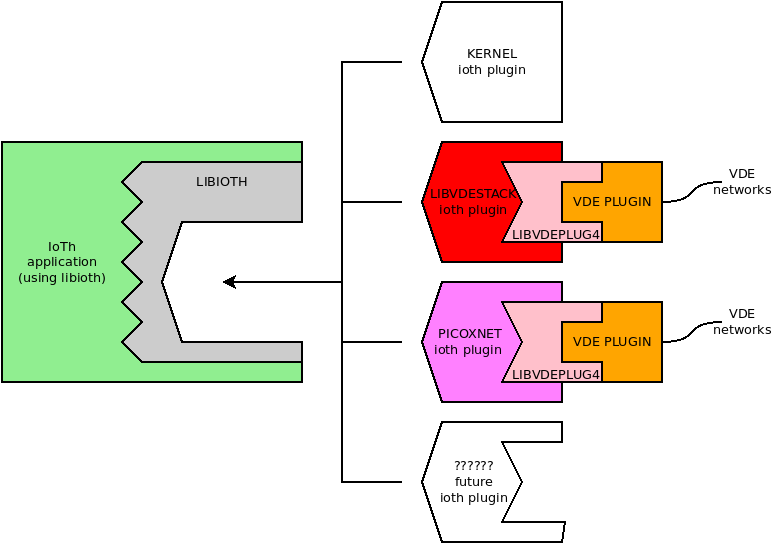

# libioth

## The definitive API for the Internet of Threads

* the API is minimal: Berkeley Sockets + msocket + newstack/delstack.
* the stack implementation can be chosen as a plugin at run time.
* netlink based stack/interface/ip configuration via _nlinline_.
* ioth sockets are real file descriptors, poll/select/ppoll/pselect/epoll friendly
* plug-ins are loaded in private address namespaces: libioth supports several stacks
of the same type (same plugin) even if the stack implementation library was designed to
provide just one stack.



## The API

### newstack

There are four flavours of `ioth_newstack`:
```C
struct ioth *ioth_newstack(const char *stack);
struct ioth *ioth_newstacki(const char *stack, const char *vnl);
struct ioth *ioth_newstackl(const char *stack, const char *vnl, ... /* (char  *) NULL */);
struct ioth *ioth_newstackv(const char *stack, const char *vnlv[]);
```
* `ioth_newstack` creates a new stack. This function does not create any interface.
* `ioth_newstacki` (i = immediate) creates a new stack with a virtual interface connected to the vde network identified by the VNL (Virtual Network Locator, see vdeplug4).
* `ioth_newstackl` and `ioth_newstackv` (l = list, v = vector) support the creation of a new stack with several interfaces. It is possible to provide the VNLs as a sequence of arguments (as in execl) or as a NULL terminated array of VNLs (as the arguments in execv).

The return value is the ioth stack descriptor, NULL in case of error (errno provides a more detailed description of the error).

### delstack

```C
int ioth_delstack(struct ioth *iothstack);
```
This function terminates/deletes a stack. It returns -1 in case of error, 0 otherwise. If there are file descriptors already in use, this function fails and errno is EBUSY.

### msocket
```C
int ioth_msocket(struct ioth *iothstack, int domain, int type, int protocol);
```
This is the multi-stack supporting extension of `socket`(2). It behaves exactly as `socket` except for the added heading argument that allows the choice of the stack among those currently available (previously created by a `ioth_newstack*`.

### for everything else... Berkeley Sockets

`ioth_close`,
`ioth_bind`,
`ioth_connect`,
`ioth_listen`,
`ioth_accept`,
`ioth_getsockname`,
`ioth_getpeername`,
`ioth_setsockopt`,
`ioth_getsockopt`,
`ioth_shutdown`,
`ioth_ioctl`,
`ioth_fcntl`,
`ioth_read`,
`ioth_readv`,
`ioth_recv`,
`ioth_recvfrom`,
`ioth_recvmsg`,
`ioth_write`,
`ioth_writev`,
`ioth_send`,
`ioth_sendto` and
`ioth_sendmsg` have the same signature and functionalities of their counterpart
 without the `ioth_` prefix.

### extra features for free: nlinline netlink configuration functions

`netlink+` provides a set of inline functions for the stack interface/ip address and route
configuration:
```C
ioth_if_nametoindex(const char *ifname);
ioth_linksetupdown(unsigned int ifindex, int updown);
ioth_ipaddr_add(int family, void *addr, int prefixlen, unsigned int ifindex);
ioth_ipaddr_del(int family, void *addr, int prefixlen, unsigned int ifindex);
ioth_iproute_add(int family, void *dst_addr, int dst_prefixlen, void *gw_addr);
ioth_iproute_del(int family, void *dst_addr, int dst_prefixlen, void *gw_addr);
ioth_iplink_add(const char *ifname, unsigned int ifindex, const char *type,
    const char *data);
ioth_iplink_del(const char *ifname, unsigned int ifindex);
```

a detailed description can be found in `nlinline`(3).

## Example: an IPv4 TCP echo server

The complete source code of this example is provided in this git repository:
[`iothtest_server.c`](https://raw.githubusercontent.com/virtualsquare/libioth/master/test/iothtest_server.c).
The code creates a virtual stack, activates the interface named `vde0`, sets the interface's address to 192.168.250.50/24 and runs a TCP echo server on port 5000.

When a new connection begins, i.e. when `accept`(2) returns a new file descriptor,
`iothtest_server` creates a thread to process the new stream.

## Example: an IPv4 TCP terminal client

The complete source code of this example is provided in this git repository:
[`iothtest_client.c`](https://raw.githubusercontent.com/virtualsquare/libioth/master/test/iothtest_client.c).
The code creates a virtual stack, activates the interface named `vde0`, sets the interface's address to 192.168.250.51/24 and runs a TCP terminal emulation client trying to get connected to 192.168.250.50 port 5000.

Please note that `iothtest_client.c` uses a `poll`(2) system call to wait for available input on a ioth socket and on `stdin`.

## testing

* start a vde switch:
```bash
     vde_plug null:// switch:///tmp/sw
```

* in a second terminal run the server using one of the following commands:
```bash
     ./iothtest_server vdestack vde:///tmp/sw
     ./iothtest_server picox vde:///tmp/sw
     vdens vde:// ./iothtest_server kernel
```

* in a third terminal run the client, again the stack implementation can be decided by choosing
one of the following commands:
```bash
     ./iothtest_client vdestack vde:///tmp/sw
     ./iothtest_client picox vde:///tmp/sw
     vdens vde:// ./iothtest_client kernel
```

* now whatever is typed in the client is echoed back, the serveer produces a log of open/closed connections and echoed messages.

## The API for plugin development

The structure of the source code a `ioth` plugin for the stack `foo` is the following:
```C
file ioth_foo.c:

#include <libioth.h>

static typeof(getstackdata_prototype) *getstackdata;

void *ioth_foo_newstack(const char *vnlv[], struct ioth_functions *ioth_f) {
    // create a new foo stack and save some data for the other functions
    struct vdestack *stackdata = ...

    // save getstackdata for the other functions
    getstackdata = ioth_f->getstackdata;

    // set the handler for all the functions
    // example 1: use the system call
    ioth->bind = bind;

    // example 2: provide a specific function (implicit assignment).
    // just name the function as ioth_foo_bind.
    // in such a case the  following assignment is automatic:
    // ioth->bind = ioth_foo_bind;

    // example 2: provide a specific function (explicit assignment)
    ioth->bind = mybind;

    .... and so on for all the other functions
     return stackdata;
}

int ioth_foo_delstack(void *stackdata) {
  // delete the foo stack
  return .... // 0 = success, -1 = failure (+ errno)
}

// example for socket
int ioth_foo_socket(int domain, int type, int protocol) {
  struct foodata *stackdata = getstackdata();
  return foo_msocket(stackdata, domain, type, protocol);
}
```

This plugin can be compiled using the following command:
```sh
gcc -o ioth_foo.so -fPIC -shared ioth_foo.c
```
The plugin does not need any ioth specific library.

The plugin `ioth_foo.so` must be installed:

* in the global plugin directory: `/usr/lib/ioth` or `/usr/local/lib/ioth` or `/usr/lib/x86_64-linux-gnu/ioth` (or similar) depending on where `libioth.so` is installed (`/usr/lib` or `/usr/local/lib` or `/usr/lib/x86_64-linux-gnu` respectively).
* in the user local directory: the hidden subdirectory named `.ioth` of the user's home directory.

When libioth is required to create a new stack of type `foo`, it loads the plugin named `ioth_foo.so`.

When the plugin has been loaded, ioth searches and runs the function `ioth_foo_newstack` passing it two parameters: the array on VNLs to define the virtual interfaces, and a structure whose fields are function pointers: `ioth_functions`.
This structure includes `getstackdata`, `newstack`, `delstack` and all the functions of the Berkeley Sockets API.

The function `getstackdata` is provided by libioth and can be saved (all the other function can call `getstackdata()` to retrieve the pointer returned by `ioth_foo_newstack`).

All the other function pointers (except `getstackdata`) can be assigned to their implementation. Alternatively, if the plugin defines functions prefixed by `ioth_foo_`, these are automatically recognized and used.
