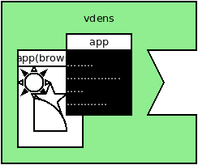
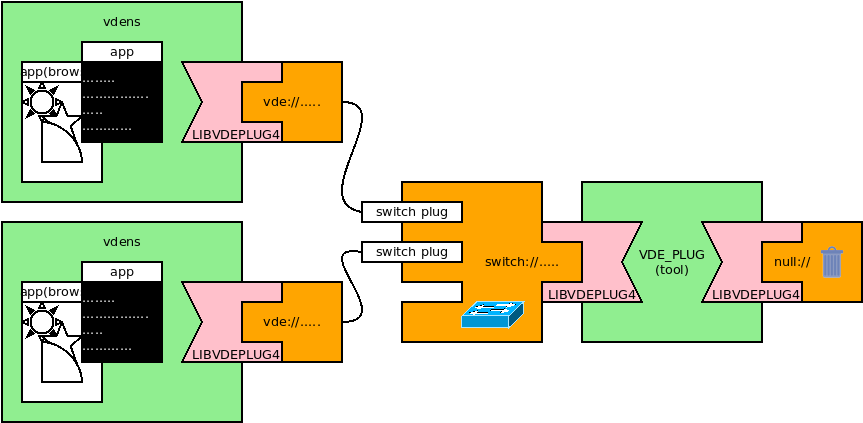
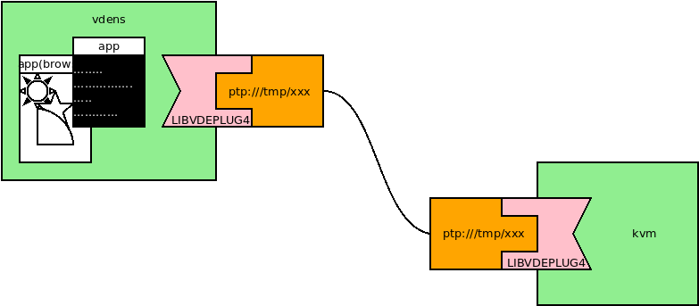
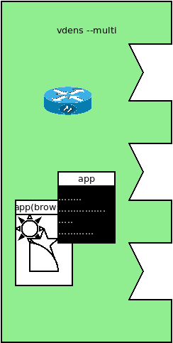
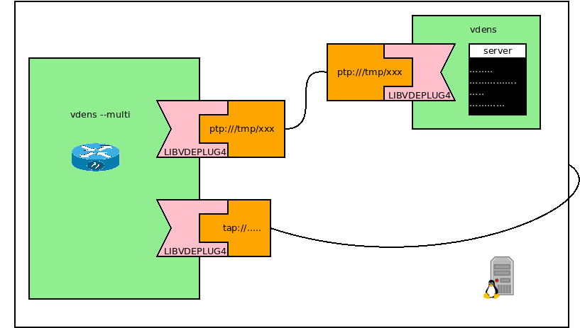
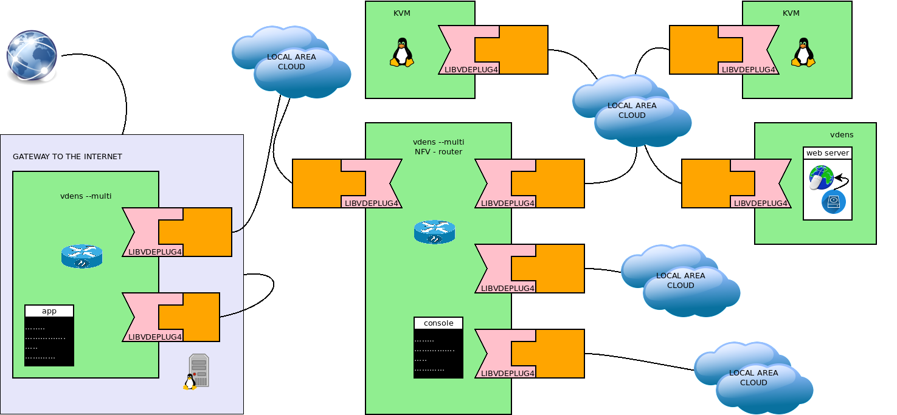

VDE namespaces and Network Function Virtualization
====

## vdens



`vdens` creates a namespace with its own independent networking services. `vdens` can have zero, one or many VDE interfaces.

In the following example `vdens` defines a localhost only network namespace.
```
$ vdens
$# ip addr
1: lo: <LOOPBACK> mtu 65536 qdisc noop state DOWN group default qlen 1000
    link/loopback 00:00:00:00:00:00 brd 00:00:00:00:00:00
$# ip link set lo up
$# ip addr
1: lo: <LOOPBACK,UP,LOWER_UP> mtu 65536 qdisc noqueue state UNKNOWN group default qlen 1000
    link/loopback 00:00:00:00:00:00 brd 00:00:00:00:00:00
    inet 127.0.0.1/8 scope host lo
       valid_lft forever preferred_lft forever
    inet6 ::1/128 scope host
       valid_lft forever preferred_lft forever
$# ping -c 3 127.0.0.1
PING 127.0.0.1 (127.0.0.1) 56(84) bytes of data.
64 bytes from 127.0.0.1: icmp_seq=1 ttl=64 time=0.034 ms
64 bytes from 127.0.0.1: icmp_seq=2 ttl=64 time=0.033 ms
64 bytes from 127.0.0.1: icmp_seq=3 ttl=64 time=0.033 ms

--- 127.0.0.1 ping statistics ---
3 packets transmitted, 3 received, 0% packet loss, time 2038ms
rtt min/avg/max/mdev = 0.033/0.033/0.034/0.000 ms
$# exit
```

`vdens` does not require to be superusers (root). The user starting `vdens` acquires all the management capabilities
on the networking stack of the namespace. So it is possible to manage the interfaces (e.g. the command `ip link set lo up`
requires `cap_net_admin` to succeed.

Note: the actual prompt may vary. In the examples `$` is the standard prompt and `$#` is the prompt of the shell running
in the namespace. Using the tutorial disk image
the prompt is something like `user@V2-20200620-303:~$net_bind_service,net_broadcast,net_admin,net_raw#`
There is a configuration in the bash rc file to show the active capabilities in the prompt (it is feature of `caprint`,
a tool of `cado`, another project by VirtualSquare.

Note: `vdens` starts a shell unless otherwise instructed. As clearly stated in the man page trailing arguments in the command line
can be used to run a specific program in the namespace.

Warning: due to a limitation of [glibc](/vbetter/vresolvconf.md), the IP address of the server for name resolution (DNS server)
cannot be configured by a user, the systemwide definition is in the file `/etc/resolv/conf`. Using virtual networks the addresses
in `/etc/resolv.conf` can be undefined (e.g. 127.0.0.1) or unreachable. `vdens` provides two options `-R` and `-r`
to solve this problem. For example use `-R 80.80.80.80` to define 80.80.80.80 as the DNS server. This option uses a mount namespace and
a file bind mount to redefine the contents of `/etc/resolv.conf`.

## Scenario: two vdens and a switch



This example requires three terminals. Start a switch in the first:
```
$ vde_plug null:// switch:///tmp/mysw
```

In the other two terminals start vdens:
```
$ vdens vde:///tmp/mysw
$#
```

now assign suitable IP addresses to the `vde0` interfaces of the namespaces. In one `vdens`:
```
$# ip addr add 10.0.0.10/24 dev vde0
$# ip link set vde0 up
```
and in the other:
```
$# ip addr add 10.0.0.11/24 dev vde0
$# ip link set vde0 up
```

Now use ping to test that the virtual etherent is up and running.

## Scenario a point to point connection between a vdens and a VM



This example requires two terminals. In one start the `vdens` using the `ptp` plugin.
```
$ vdens ptp:///tmp/myptp
$# ip addr add 10.0.0.15/24 dev vde0
$# ip link set vde0 up
```
In the other start a VM, for example a qemu/kvm running alpine as explained in
[the previous tutorial](vde_vm.md).
```
$ qemu-system-x86_64 -cdrom alpine-virt-3.12.0_rc5-x86_64.iso -monitor stdio \
    -device e1000,netdev=vde0,mac=$(randmac -q) -netdev vde,id=vde0,sock=ptp:///tmp/myptp
```
Log in as root in the VM and configure its `eth0` interface.
```
# ip addr add 10.0.0.1/24 dev eth0
# ip link set eth0 up
```

The virtual (point-to-point) network is ready. Test it using ping, netcat or whatever you like.

## vdens --multi

The option `--multi` (or `-m`)  defines a `vdens` with multiple interfaces.



THe follwoing command command:
```
$ vdens --multi vde:///tmp/mysw ptp:///tmp/myptp
```
defines a `vdens` with two controllers (not counting `lo`):
`vde0` is conencted to the switch `/tmp/mysw` while `vde1` is a point-to-point
	connection identified by the path `/tmp/myptp`.

In general `vdens --multi` defines as many `vde` controllers as VNL arguments in the command line.
As one may expect the number of the controller reflects the sequence of arguments.

## vdens-multi as VDE router (NFV)

The following example uses a `vdens` as a masquerading router. NAT is just one of the network function which can
be implemented ina `vdens`: potentially all the NFV action that can be implemented in a linux box, like packet screening
and shaping. bridging, traffic prioritization, should work properly in `vdens` using exacly the same commands.
There are just two differences:

* `vdens` interconnects virtual controllers of virtual networks instead pf physical controllers
* for this there is no need to acquire  administration privileges (`root`/`cap_net_admin`).



Define a tap interface and set up its IP address.
```
$ su -
# ip tuntap add mode tap name tap0 user user
# ip addr 10.0.0.254/24 dev tap0
# ip link set tap0 up
# exit
$
```

Start the `vdens --multi` at the left hand side of the picture.
```
$ vdens --multi ptp:///tmp/myptp tap://tap0
$# ip addr add 10.0.1.1/24 dev vde0
$# ip addr add 10.0.0.1/24 dev vde254
$# ip link set vde0 up
$# ip link set vde1 up
```

In onther terminal start the vdens on the right:
```
$ vdens ptp:///tmp/myptp
$# ip addr add 10.0.1.2/24 dev vde0
$# ip link set vde0 up
$# ip route add default via 10.0.1.1
```

Now there are two virtual networks. From the `vdens --multi` session it is possible to reach both
10.0.0.254 (the tap interface) and 10.0.1.2 (the other `vdens`).
From 10.0.1.2 it is not possible to reach 10.0.0.254 as the `vdens --multi` namespace has not been
configured as a router yet.

then in the terminal where the `vdens --multi` session is running type the following commands:
```
$# echo "1" > /proc/sys/net/ipv4/ip_forward
$# /sbin/iptables -t nat -A POSTROUTING -o vde1 -j MASQUERADE
```
Now the namespace has acquired the role of NAT/masquerading router so it is possible from the other namespace
(10.0.1.2) to reach the tap interface (10.0.0.254).

This is just an example. Using the VDE components as if they were tiles of a building blocks set it is possible to
set up complex scenarios. The following picture shows an example of structure that can be built using the components
described in this tutorial (including the following sections).



