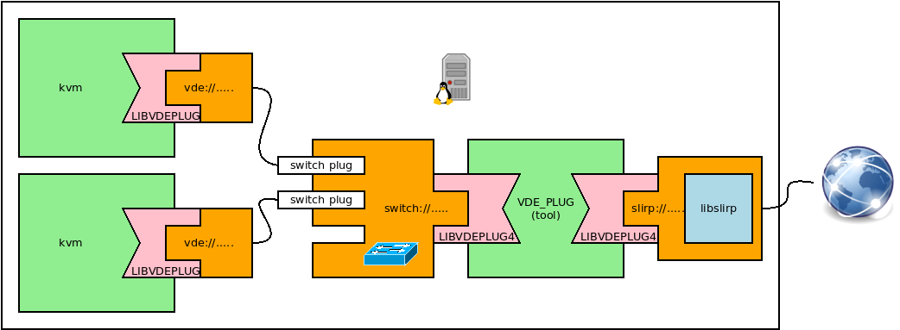
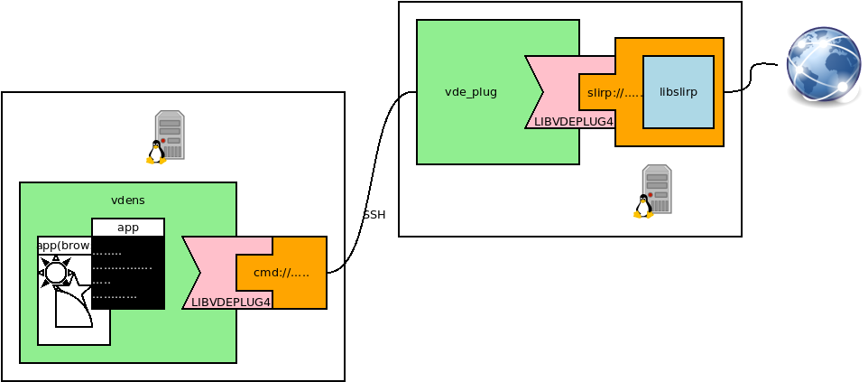
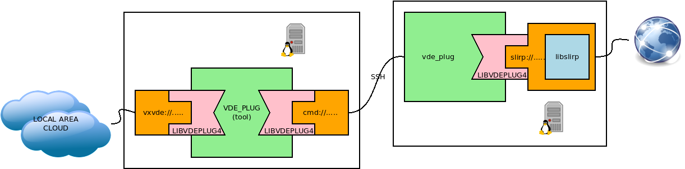

VDE Slirp
====

[Slirp](https://en.wikipedia.org/wiki/Slirp) is a network stack emulator. It
emulates a router providing
[NAT/masquerading](https://en.wikipedia.org/wiki/Network_address_translation).
Every connection from a machine within the virtual network to the slirp
address is translated, masqueraded and re-generated by slirp and redirected
to the host machine stack. It provides
functionalities like dhcp service, port forwarding and dns requests re-mapping.

## A virtual network connected to the Internet

In this example a VDE switch provides a routing service to the Internet through the `slirp`
plugin.

Note: Slirp does not need any privilege or capability to run.



### start the VDE switch

Open a terminal and run:
```
$ vde_plug switch:///tmp/mysw slirp://
```

### start the clients

For example start a qemu/kvm VM:
```
$ qemu-system-x86_64 -cdrom alpine-virt-3.12.0_rc5-x86_64.iso -monitor stdio \
        -device e1000,netdev=vde0,mac=$(randmac -q) -netdev vde,id=vde0,sock=vde:///tmp/mysw
```

Log-in the VM as `root`. The configuration of `eth0` can be done by `dhcp`:
```
# ip link eth0 up
# udhcpc
```

Ping __cannot__ be used to test the connectivity as slirp does not forward ICMP packets.
`nc` can be used instead.
```
# nc -vz 80.80.80.80 53
80.80.80.80 (80.80.80.80:53) open
# nc -zv www.google.com 80
www.google.com (216.58.208.164:80) open
```

This is just a connectivity test. As a test on a real network service let us try `ssh`.
```
# apk install openssh-client
# ssh user@your.favourite.host
....
```
## A _foreign_ namespace

This tutorial shows how to set up a `vdens` whose networking connections are routed
through a remote host.

Note: `ssh` access as a ordinary user is all what it is needed on the remote host.
(VDEplug4 and the slirp plugin can be installed inside the user's home directory).



### Create a `ssh` key and set up the key-based authorization on the remote host

```
$ ssh-keygen
...
Your public key has been saved in /home/user/.ssh/id_rsa.pub
...
$ cat /home/user/.ssh/id_rsa.pub | ssh user@my.remote.host cat >> .ssh/authorized_keys
```

Now if everything works as expected you should be able to login using the
key authorization:
```
$ ssh user@my.remote.host
remote.host.prompt$ logout
$
```

### start `vdens`

This tutorial uses the `cmd` plugin. `cmd://'command args'` runs `command`, all the VDE packets are exchanged
using a VDE stream on stdin/stdout.

So the commands to start and configure the architecture depicted in the figure above are:
```
$ vdens -R 10.0.2.3 cmd://"ssh user@my.remote.host vde_plug slirp://"
$# /sbin/udhcpc -i vde0
```
The namespace _lives_ in a virtual network. All the network traffic is routed through the remote host.

Note: `10.0.2.3` is the default address for the DNS forwarder provided by slirp. Any reachable open/available
domain name server can be used instead, e.g. `80.80.80.80`,

As above we can use netcat to test the connectivity.
```
$# nc -zv google.com 80
Connection to google.com (216.58.206.46) 80 port [tcp/http] succeeded!
$#  nc -vz 80.80.80.80 53
Connection to 80.80.80.80 53 port [tcp/domain] succeeded!
```

All the connections will be seen as if they were originated by the remote host. The following command will show the
IP address of the remote host.
```
$# wget -qO - icanhazip.com
```

## A remotely routed local area cloud

A nice combination of VDE tools permit to implement a local area cloud whose traffic is routed through a remote node.
All the VDE clients (virtual machines, `vdens`, etc.) connected to the local area cloud will use the remote slirp.



The command to set up this infrastucutre is:
```
vde_plug vxvde://234.0.0.1 cmd://'ssh user@my.remote.host vde_plug slirp://'
```

Now (on any host of the local area network) run a VDE client, for example a `vdens`:
```
$ vdens -R 80.80.80.80 vxvde://234.0.0.1
$# /sbin/udhcpc -i vde0
$# wget -qO - icanhazip.com
```
it returns the IP address of the remote host.

