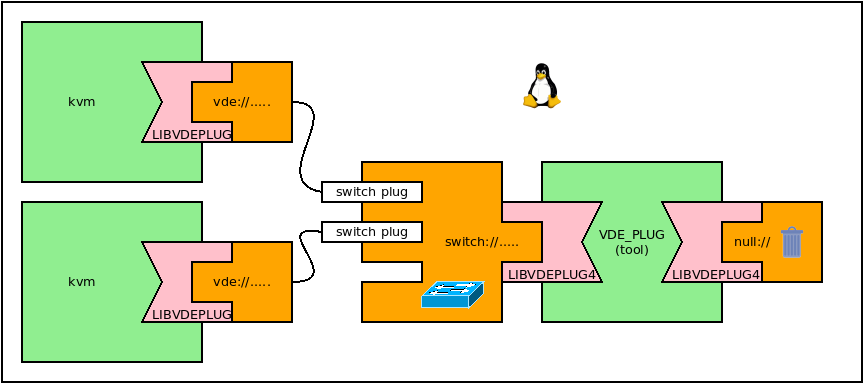
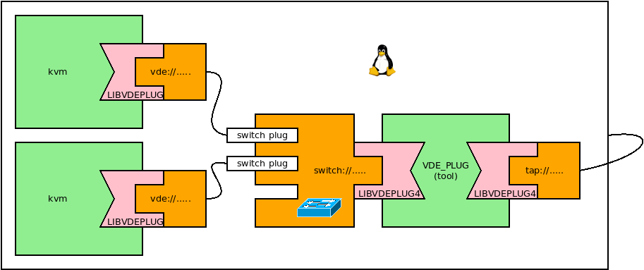
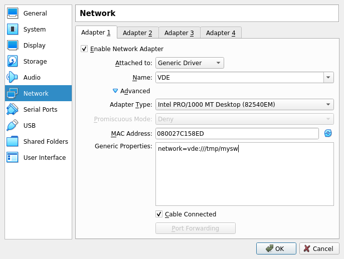

VDE and Virtual Machines
====

This tutorial has been designed to run on a virtual machine or in a Linux box
where the virtualsquare tools have been installed as described in the previous tutorials:
[Set up the Virtual Machine](setup_the_vm.md) or [Set up a Linux host](setup_a_host) respectively.

Note: many examples require to use several virtual terminals. On a Linux Box just start several
x-terminals. No GUI has been installed in the virtual machine configured for the VirtualSquare tutorials.
It is clearly possible to install your favorite GUI (like as _gnome_, _kde_, _lxde_...).
It is also possible for the processes of the VM to have their GUIs through the X-server of the hosting computer.
If the VM has been using the commands suggested in the [_Set up the Virtual Machine_](setup_the_vm.md) 
run (on the hosting computer):
`ssh -X -p 2222 user@localhost xterm`.
The resulting `xterm` is running on the virtual machine and from there it is possible to start other virtual
terminals (`xterm &`) or other X-window clients (e.g. `qemu-system-x86_64`).


This tutorial is not meant to be a guide to implement projects based on VirtualSquare tools but
to provide users with examples to explain how to use VDE.

This tutorial uses minimal Linux distributions in the Virtual Machines of the examples and if  
the tutorial in a VM the examples will start a second layer of virtualization.

The goal here is to show how to use VDE, all the commands can be applied to more realistic
scenarios on production VM.

## Two qemu/kvm machines connected by a switch.

The architecture we want to get is depicted here below:



### install `qemu-system-x86`

```
$ su -
# apt-get update
# apt-get install qemu-system-x86
# exit
$
```

### load a disk image for the qemu/kvm VMs

```
$ wget http://dl-cdn.alpinelinux.org/alpine/v3.12/releases/x86_64/alpine-virt-3.12.0-x86_64.iso
```
or the latest version in [Alpine Linux download page](https://alpinelinux.org/downloads/) in the section
`VIRTUAL`.

### start a VDE switch:

Open a terminal and run:
```
$ vde_plug null:// switch:///tmp/mysw
```

Note: this is a very simple switch. It does not provide remote management, vlan support, loop avoidance (fast spanning tree).
VirtualSquare provides `vde_switch` which supports all these features.

Note: The _name_ of the switch is `/tmp/mysw`. All the VDE clients using the UVDEL `vde:///tmp/mysw` will be connected
by a virtual ethernet.

### start the qemu/kvm virtual machines:

Open two more terminals and start the qemu/kvm VMs.

Type the same command on both terminals: either the command to run qemu:
```
$ qemu-system-x86_64 -cdrom alpine-virt-3.12.0_rc5-x86_64.iso -monitor stdio \
		-device e1000,netdev=vde0,mac=$(randmac -q) -netdev vde,id=vde0,sock=vde:///tmp/mysw
```
or the command to run kvm:
```
$ qemu-system-x86_64 -enable-kvm -cdrom alpine-virt-3.12.0_rc5-x86_64.iso -monitor stdio \
		-device e1000,netdev=vde0,mac=$(randmac -q) -netdev vde,id=vde0,sock=vde:///tmp/mysw
```

Warning: nested kvm is allowed only if that feature has been enabled by a specific option of the kernel module in the hosting system
(`nested=Y` for `kvm-intel` or `nested=1` for `kvm-amd`) as described [in this page](https://www.linux-kvm.org/page/Nested_Guests).

### configure the networking of the VDE connected virtual machines

Log in as root in the two virtual machines and configure their `eth0` iterfaces.

On the first:
```
# ip addr add 10.0.0.1/24 dev eth0
# ip link set eth0 up
```

on the other:
```
# ip addr add 10.0.0.2/24 dev eth0
# ip link set eth0 up
```

Now it is possible for each VM to `ping` the other. The virtual ethernet is up and running.

## Connect the switch to a tap interface



Create the tap interface and assign it to the user `user`.
```
$ su -
# ip tuntap add mode tap name tap0 user user
# ip addr 10.0.0.254/24 dev tap0
# ip link set tap0 up
#exit
$
```

Start the switch connected to the tap interface:
```
$ vde_plug tap://tap0 switch:///tmp/mysw
```

Start the VMs as described above.

Now it is possible to ping `10.0.0.254` from the VM and `10.0.0.1/10.0.0.2` from the tutorial machine.
This three node VDE is up and running.

## Join User-Mode-Linux machines to VDE networks

The command line parameter to create a VDE virtual interface of a User-Mode Linux machine is: `eth`n`=vde,`UVDEL. For example:
`eth0=vde:///tmp/mysw` create the virtual interface eth0 connected to the switch `/tmp/mysw`

Attention: User-Mode Linux uses the static version of the VDE plug. So it uses the version of VDE available when the User-Mode
Linux kernel was compiled. So, the version currently available as Debian package uses VDE version 2, so only pathname can be used
as UVDEL, e.g. `eth0=vde:/tmp/mysw`.  As soon as vdeplug4 is entering in Debian SID, User-Mode Linux will be automatically updated at its
first rebuild.

### install User-Mode Linux

UM-L can be installed from the Linux distribution:
```
$ su -
# apt-get update
# apt-get user-mode-linux
# exit
```

At the time of writing this package is still using the old library as explained in the box above.

As an alternative to test the new features of VDEplug4, we have build a UM-L kernel `linux_vdeplug4` that can be downloaded from
[the tutorial resource page](tutorial_resources.html). The file can be downloaded using wget, then set the exec permission:
`chmod +x linux_vdeplug4`.


Hint: If you want to build your own UM-L kernel, Download the Linux Kernel sources (e.g. from _kernel.org_), copy the file `config4UML`
(also available in the tutorial resources page) in the linux source tree root changing the name to `.config`. Run `make ARCH=um SUBARCH=x86_64 menuconfig` and modify the configuration to fit your needs. Build the kernel: `make ARCH=um SUBARCH=x86_64`. At the end the file named
`linux` in the source root is the User-Mode Linux kernel.

### Choose a root file system

We also set up a disk image of minimal root tree to test the UM-L virtual mechines. It is the file `BusyBox-1.21.1-amd64-root_fs.bz2` in
[the tutorial resource page](tutorial_resources.html) (credit: this image is an updated version of the one provided in
[the Linux Filesystems page of /dev/loop.org.uk](https://fs.devloop.org.uk/)
Download the disk image using wget and then uncompress it:
```
$ bunzip2 -k BusyBox-1.21.1-amd64-root_fs.bz2
```

### Run User-Mode Linux

Now there are all the _ingredients_ to start the UM-L VM. This is the command using the old syntax:
```
$ linux ubd0=cowfile0,BusyBox-1.21.1-amd64-root_fs eth0=vde,/tmp/mysw
```
The new syntax (if supported by the `linux` command) is:
```
$ ./linux_vdeplug4 ubd0=cowfile1,BusyBox-1.21.1-amd64-root_fs eth0=vde,vde:///tmp/mysw
```
This latter syntax enables the support of all the VDEplug4 plugins. 

Warning: do not start two or more VM using the same disk image. 
The file system structure of the disk image would be corrupted.
Use different copies of the disk image or use the _copy-on-write_ (COW) feature as in the command lines of the examples here above.
In fact: `ubd0=cowfile0,BusyBox-1.21.1-amd64-root_fs` means that `BusyBox-1.21.1-amd64-root_fs` will be accesses in read-only mode
while all the modifications will take place in `cowfile0`. In this way using different COW files it is possible to start several UM-L VMs
keeping the file `BusyBox-1.21.1-amd64-root_fs` unmodified.


<!-- Warning: the following example uses a minimal image loaded using hostfs and /bin/sh as init. It is just a proof-of concept to
test a ping.  There is one console and no job control. The only way to stop a looping process is to kill the entire User-Mode Linux
VM, e.g. by running `killall linux` from another terminal. Use `-c` for the ping command, e.g. `ping -c 3 10.0.0.254`.

```
$ wget http://dl-cdn.alpinelinux.org/alpine/v3.12/releases/x86_64/alpine-minirootfs-3.12.0-x86_64.tar.gz
$ mkdir alpine-root
$ (cd alpine-root ; tar xf ../alpine-minirootfs-3.12.0-x86_64.tar.gz)
$  linux root=/dev/root rootflags=/home/user/alpine-root rootfstype=hostfs eth0=vde,/tmp/mysw init=/bin/sh
```
-->

Now at the prompt of the VM it possible to test the VDE networking support:
```
# ip addr add 10.0.0.3/24 dev eth0
# ip link set eth0 up
# ping -c 3 10.0.0.254
```
### A little detour: how to use `BusyBox-1.21.1-amd64-root_fs` with qemu/kvm.

For the sake of completeness it is possible to use the minimal disk image `BusyBox-1.21.1-amd64-root_fs` with `qemu/kvm`.

The image cannot be used to boot a virtual machine as it does not include the kernel.

We have provided (in [the tutorial resource page](tutorial_resources.html) as usual) a kernel for `qemu/kvm`, the file name is
`vmlinuz_qemu`. Download it and start a VM as follows:
```
$ cp BusyBox-1.21.1-amd64-root_fs minfs0
$ qemu-system-x86_64 -enable-kvm -m 512M -kernel vmlinuz_qemu -append "root=/dev/sda" \
    -drive file=minfs0 \
    -device e1000,netdev=vde0,mac=$(randmac -q) -netdev vde,id=vde0,sock=vde:///tmp/mysw
```
or in text-only mode:
```
$ cp BusyBox-1.21.1-amd64-root_fs minfs1
$ qemu-system-x86_64 -enable-kvm -nographic -m 512M -k en-us\
    -kernel vmlinuz_qemu -append "root=/dev/sda  console=ttyS0,9600n8" -drive file=minfs1 \
    -device e1000,netdev=vde0,mac=$(randmac -q) -netdev vde,id=vde0,sock=vde:///tmp/mysw
```
(remove `-enable-kvm` to run `qemu` instead of `kvm`) 

Hint: You can build your own kernel for qemu/kvm. Download the Linux Kernel sources (e.g. from kernel.org), 
copy the file config4AEMU (available in the tutorial resources page) in the linux source tree root changing the name to .config. 
Run `make menuconfig` and modify the configuration to fit your needs. Then build the kernel: `make`. 
At the end the file `arch/x86_64/boot/bzImage` is the kernel (in compressed format). Copy it with a suitable name (like `vmlinuz_qemu`)

## Join VirtualBox virtual machines to VDE networks

Unfortunately VirtualBox cannot run nested VMs inside Kvm. So this tutorial can be tested only on a Linux host.

### install VirtualBox
```
$ su -
# apt-get update
# apt-get install virtualbox
# exit
```

Note: virtualbox is not in the _main_ Debian distribution, it is in the _contribution_. The file `/etc/apt/sources.list`
must be cofnigure to allow the installation of packages from the _contribution_ repository

### configure VirtualBox

The following picture shows an example of configuration of a VDE network interface.



The Alpine image used for qemu/kvm can be used to test VirtualBox.

Warning: there are compatibility issues. Debian packages are consistent: if you install both VDE and VirtualBOX from 
Debian they are compatible (any version, stable, testing, unstable), but only VDE2 syntax is supported
(so in the example above `network=/tmp/mysw` must be used instead of `network=vde:///tmp/mysw`.
VirtualBox does __not__ support VDEplug4 if installed in /usr/local (e.g. if installed from GITHUB).(\*)
An inelegant workaround that can be used to test VDEplug4 is to copy all the plugins in /usr/lib.
`mkdir /usr/lib/vdeplug; cp /usr/local/lib/vdeplug/* /usr/lib/vdeplug`

Note: (\*) This is a limitation of VirtualBox: 
_"
In addition to what the dynamic linker does for us, the VirtualBox code will
not directly be calling either RTLdrLoad or dlopen to load dynamic link
libraries into the process. Instead it will call \#SUPR3HardenedLdrLoad,
\#SUPR3HardenedLdrLoadAppPriv and \#SUPR3HardenedLdrLoadPlugIn to do the
loading. These functions will perform the same validations on the file being
loaded as #SUPR3HardenedMain did in its validation step.  So, anything we
load must be installed with root/wheel as owner/group, the directory we load
it from must also be owned by root:wheel and now allow for renaming the file.
Similar ownership restrictions applies to all the parent directories (except
on darwin).
"_
(SUPR3HardenedMain.cpp lines 143 and following)
