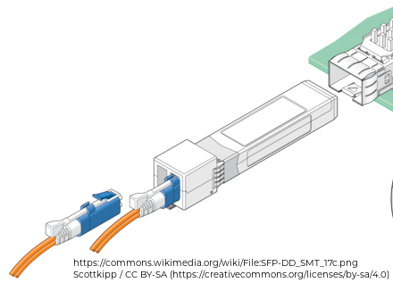
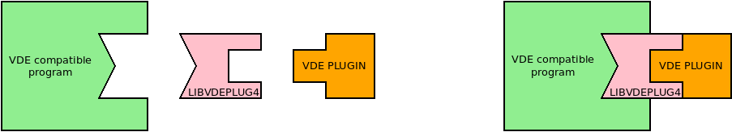
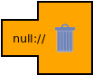
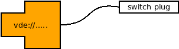
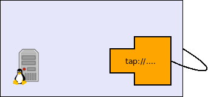
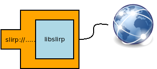
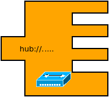
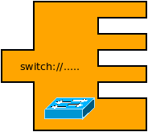
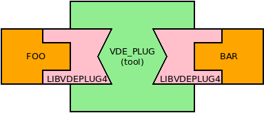
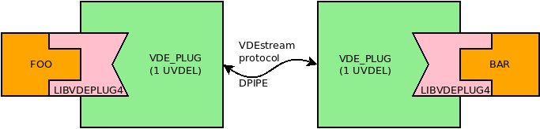

VDE Basic Networking
====

The core concept of VDE is the plug. Many virtual machine monitors like _qemu_, _kvm_, _user-mode linux_ and _virtualbox_
are VDE compatible. So it is like these VMM had a socket for VDE plugs.

Other programs providing sockets for VDE plugs include user-level TCP/IP stacks like _lwipv6_, _picotcp_, networking namespace monitors
like _vdens_, namespace implemented TCP/IP stacks (_libvdestack_), educational emulators (_umps, umps3_).

VDEplug4 plugs have a modular design, the actual implementation of VDE used set up the virtual network can be defined by loading a specific
plug-in module.

A good metaphore to understand the structure of the VDE plugs is the Small form-factor pluggable transceiver (SFP).
Nowadays many (physical) networking appliances have SFP ports. These port can be used to support several different types
of transceivers, providing connections using different media (e.g. copper or fiber optics) and line speeds.

In VDE the same concept is virtualized: All the programs supporting VDE use the general purpose libvdeplug API. The VDE
plugins play the role of the SFP transceivers and support different implementations of the virtual ethernet networks.

### UVDEL

The choice of the plugin and the configuration parameters are given by a string named UVDEL (unified VDE locator).
The name reminds the web addesses (URLs) as UVDELs use a similar syntax.

Examples:

* `null://` a valid interface to a null network (like `/dev/null` for devices)

  

* `vde:///var/run/myswitch` connect to a virtual switch or hub (compatible with `vde_switch` of vde2)

  

* `tap://tap0` connect to a tap interface of the hosting Linux box

  

* `vxvde://234.0.0.1`become a node of a _vxvde_ local area cloud

  

* `slirp://` connect to the internet using a slirp network emulator

  

* `hub://` create a hub

  

* `switch://` create a switch

  

* .... and many others

Note: In order to preserve the backwards compatibility with vde2, a pathname is a legal UVDEL. The path `/a/b/c/d` is equivalent to
`vde:///a/b/c/d`

### The `vde_plug` tool

`vde_plug` connects two plugins in two different ways:

* when `vde_plug` has two UVDEL arguments it connects them directly:

  `vdeplug foo://... bar://...`

  

* when `vde_plug` has only one argument it uses the standard streams (`stdin`, `stdout`) to communicate, so it needs a second `vde_plug` connected
through a dual pipe (`dpipe` command) to connect the other plugin:

  `dpipe vde_plug foo://... = vde_plug bar://`

  

  The bidirectional stream can be processed: any tool able to support a bidirectional stream can be used. As an example we could want foo and bar to
run on different hosts, we can use ssh to forward the stream:

  `dpipe vde_plug foo://... = ssh remote.host vde_plug bar://`

