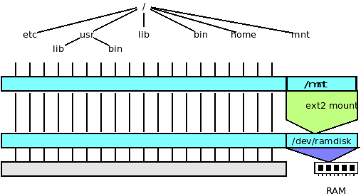
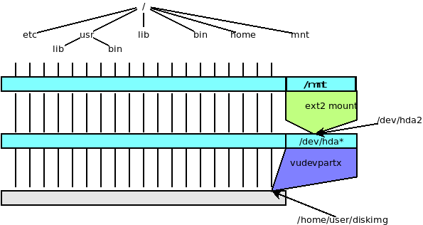

`vudev` VUOS virtual devices
====

`vudev` is the module to create virtual devices.

The standard way to interact with devices in UNIX is through _special files_
i.e. entries in the file systems that appear as files. The purpose of _special files_ is
just to give a pathname that can be used by programs to identify and access the device.
Special files can _appear_ in the file system using using `vudev` submodules.

## vudevramdisk

`vudevramdisk` allocates a RAM area and makes it available as a virtual disk.

The meaning of the shell session below is:

* add the `vudev` and `vufuse` VUOX modules.
* use `vumount` to create the device
* show that it effectively appears as a block device
* the hex-dump shows a 10MB empty area

```bash
$$ vu_insmod vudev vufuse
$$ vumount -t vudevramdisk -o size=10M none /dev/ramdisk
$$ ls -l /dev/ramdisk
brw------- 0 user user 0, 0 Aug  8 09:06 /dev/ramdisk
$$ od -x /dev/ramdisk
0000000 0000 0000 0000 0000 0000 0000 0000 0000
*
200000000
$$
```

Now it is possible to create a file system structure on the virtual file system and then
mount it.

```bash
$$ /sbin/mkfs.ext2 /dev/ramdisk
mke2fs 1.45.6 (20-Mar-2020)
warning: Unable to get device geometry for /dev/ramdisk
Creating filesystem with 32768 1k blocks and 8192 inodes
Filesystem UUID: a3233045-566a-4f6d-aed7-e2806fd31904
Superblock backups stored on blocks:
        8193, 24577

Allocating group tables: done
Writing inode tables: done
Writing superblocks and filesystem accounting information: done

$$ mount -t vufuseext2 -o rw+ /dev/ramdisk /mnt
$$ ls /mnt
lost+found
$$
```

Graphically the structure can be depicted as follows:



## vudevpartx

This submodule is able to manage both the partitioning scheme MBR and GPT.
So it is possible to _mount_ a disk image and have access to its partitions.

Let us create an empty 200MB file and create a GPT partitiontable on it by `fdisk`.

```bash
$$ vu_insmod vudev vufuse
$$ truncate -s 200M diskimg
$$ /sbin/fdisk diskimg

Welcome to fdisk (util-linux 2.36).
Changes will remain in memory only, until you decide to write them.
Be careful before using the write command.

Device does not contain a recognized partition table.
Created a new DOS disklabel with disk identifier 0x4870e71c.

Command (m for help): g
Created a new GPT disklabel (GUID: 1D18D7AF-C42D-A349-B53C-328F229BCCD8).

Command (m for help): n
Partition number (1-128, default 1):
First sector (2048-409566, default 2048):
Last sector, +/-sectors or +/-size{K,M,G,T,P} (2048-409566, default 409566): +100M

Created a new partition 1 of type 'Linux filesystem' and of size 100 MiB.

Command (m for help): n
Partition number (2-128, default 2): 2
First sector (206848-409566, default 206848):
Last sector, +/-sectors or +/-size{K,M,G,T,P} (206848-409566, default 409566):

Created a new partition 2 of type 'Linux filesystem' and of size 99 MiB.

Command (m for help): p
Disk diskimg: 200 MiB, 209715200 bytes, 409600 sectors
Units: sectors of 1 * 512 = 512 bytes
Sector size (logical/physical): 512 bytes / 512 bytes
I/O size (minimum/optimal): 512 bytes / 512 bytes
Disklabel type: gpt
Disk identifier: 1D18D7AF-C42D-A349-B53C-328F229BCCD8

Device      Start    End Sectors  Size Type
diskimg1     2048 206847  204800  100M Linux filesystem
diskimg2   206848 409566  202719   99M Linux filesystem

Command (m for help): w
The partition table has been altered.
Syncing disks.

$$
```

`vudevpartx` mounts `/home/user/diskimg` as `/dev/hda`, i.e.
each partition of the disk image can be individually mounted as `/dev/hda1`, `/dev/hda2`, etc.

```bash
$$ vumount -t vudevpartx /home/user/diskimg /dev/hda
$$ /sbin/mkfs.ext4 /dev/hda2
mke2fs 1.45.6 (20-Mar-2020)
warning: Unable to get device geometry for /dev/hda2
Creating filesystem with 101356 1k blocks and 25376 inodes
Filesystem UUID: 86ab39fd-be6f-4f54-8e2c-565a25c7cb9f
Superblock backups stored on blocks:
        8193, 24577, 40961, 57345, 73729

Allocating group tables: done
Writing inode tables: done
Creating journal (4096 blocks): done
Writing superblocks and filesystem accounting information: done

$$ mount -t vufuseext2 -o rw+ /dev/hda2 /mnt
$$ ls /mnt
lost+found
$$
```



## A Practical example: modify config.txt in a Raspbian/RaspPiOS image

Let us suppose that the disk image is `/tmp/2020-05-27-raspios-buster-lite-armhf.img`.

THis is the recipe:
```
$$ vu_insmod vudev vufuse
$$ mount -t vudevpartx /tmp/2020-05-27-raspios-buster-lite-armhf.img /dev/hdp
$$ mount -t vufusefatfs -o rw+ /dev/hdp1 /mnt
$$ vi /mnt/config.txt 
... update the contents of config.txt
$$ vuumount /mnt
$$ vuumount /dev/hdp
```

## other virtual devices

Note:  we are currently developing
the support for more virtual devices.

