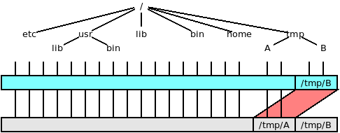
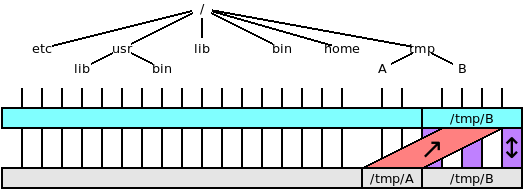
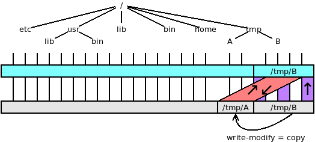
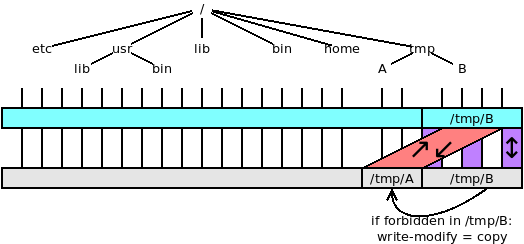

`vufs`: VUOS virtual filesystems
====

Files and file system subtrees can be moved, merges, can be made _virtually
writable_, it is possible to change ownership and permission, create virtual devices
using `vufs`

This table summarizes the four modes of vufs. A short description of each mode follows.

`vumount -t vufs -o mode A B`

| mode        | A           | B           | comments:   |
| ----------- | ----------- | ----------- | ----------- |
| bind (default) | R/W         | not accessible | A substitutes B |
| merge | Read Only  | R/W | merge A _on_ B, updates in B |
| cow | R/W | Read Only | merge A _on_ B, updates in A, copy-on-write |
| mincow | R/W | R/W | merge A _on_ B, updates in B, copy-on-write on A if not permitted |

### bind mode



This is the default mode (the option `-o bind` can be omitted.

```bash
$$ vu_insmod vufs
$$ vumount -t vufs /tmp/a /tmp/b
```
or
```bash
$$ vumount -t vufs -o bind /tmp/a /tmp/b
```

The contents of `/tmp/a` appear in `/tmp/b` too.  The original contents of `/dev/b`
cannot be accessed.

### merge mode

```bash
$$ vumount -t vufs -o merge /tmp/a /tmp/b
```

The contents of `/tmp/a` is merged with the contents of `/tmp/b`. More precisely the contents
of `/tmp/a` are _added_ to those of `/tmp/b`. If a file or directory exists both in `/tmp/a`
and  `/tmp/b` the one in `/tmp/a` prevails. The files and directories coming from
`/tmp/a` are in read-only mode. New files and directories are created in `/tmp/b`,
any modification takes place in `/tmp/b`.



### copy-on-write (cow) mode

```bash
$$ vumount -t vufs -o cow /tmp/a /tmp/b
```

The contents of `/tmp/a` is merged with the contents of `/tmp/b`. The original contents
of `/tmp/b` are not modified. All new files and directories are created in `/tmp/a`.
Changes in files originally in `/tmp/b` causes the file to be copied in `/tmp/a` and
then modified.



```bash
$$ vumount -t vufs -o mincow /tmp/a /tmp/b
```

### minimal copy-on-write (cow) mode

Minimal means that files are copied only when it is not possible to update the original
files. So in this mode the contents of `/tmp/a` is merged with the contents of `/tmp/b`.
`vufs` tries to perform the actions requested on `/tmp/b`. If then it discovers that
the action is not permitted on `/tmp/b` it works on `/tmp/a` copying the files when
needed.



## Some magic: disappearing directories

Here is the content of `/var` and `/var/spool`:
```bash
$$ ls /var
backups  cache  lib  local  lock  log  mail  opt  run  spool  tmp
$$ ls -l /var/spool
total 8
drwxr-xr-x 3 root root 4096 Jun 20 04:30 cron
lrwxrwxrwx 1 root root    7 Jun 20 04:28 mail -> ../mail
drwx------ 2 root root 4096 Apr 28 16:28 rsyslog
```

Let us not set up a directory in `/tmp/var` and an empty subdir `/tmp/var/spool`
```bash
$$ mkdir /tmp/var
$$ mkdir /tmp/var/spool
```

And now using `vufs`, bind mode and an exception all the subdirectories of
`/var/` disappear (except `/var/spool`):
```bash
$$ vumount -t vufs -o bind,except=/spool /tmp/var /var
$$ ls /var
spool
$$ ls -l /var/spool
total 8
drwxr-xr-x 3 root root 4096 Jun 20 04:30 cron
lrwxrwxrwx 1 root root    7 Jun 20 04:28 mail -> ../mail
drwx------ 2 root root 4096 Apr 28 16:28 rsyslog
```
## (virtually) modify system files

Create a empty directory and mount it in `mincow` mode:
```bash
$$ mkdir /tmp/newroot
$$ vumount -t vufs -o mincow,except=/tmp,except=/proc /tmp/newroot /
```

Now using your favorite editor (e.g. `vi` or `nano`) delete the line
of teh user `user` from /etc/passwd
```bash
$$ nano /etc/passwd
# .... delete the line and save
$$ whoami
whoami: cannot find name for user ID 1000
```

Now delete a file in /etc
```bash
$$ vu_insmod vufs
$$ vumount -t vufs -o mincow /tmp/newroot/ /
$$ ls -l /etc/protocols
-rw-r--r-- 1 root root 2932 Apr  1  2013 /etc/protocols
$$ rm /etc/protocols
rm: remove write-protected regular file '/etc/protocols'? y
$$ ls -l /etc/protocols
ls: cannot access '/etc/protocols': No such file or directory
```

It is also possible to (virtually) change ownership or permissions of files.
```bash
$$ ls -l /etc/passwd
-rw-r--r-- 1 root root 1689 Jul 22 16:10 /etc/passwd
$$ chown user /etc/passwd
$$ chmod 600 /etc/passwd
$$ ls -l /etc/passwd
-rw------- 1 user root 1689 Jul 22 16:10 /etc/passwd
```
