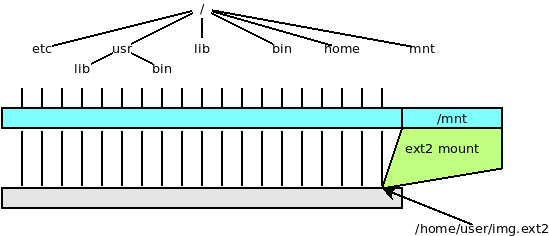

`vufuse`: VUOS FUSE
====

Using [FUSE](https://en.wikipedia.org/wiki/Filesystem_in_Userspace) it is possible for
users to run file systems implementation in user space. Using the device `/dev/fuse` a kernel module acts as a _bridge_ to the VFS interface.

`vufuse` provides the same service (and it almost completely source code compatible with 
FUSE). There are notable differences:

* `vufuse` does not require kernel code,
* FUSE mounted file systems are _visible_ for all the processes while `vufuse` mounted
file systems can be seen only by the processes running under the control of the `umvu`
hypervisor.

Note:  we are currently porting the support for more file system
types and we are working on the alignment with the latest developments of FUSE.

## ext2/3/4 filesystems

The submodule `vufuseext2` supports ext2, etx3 and ext4 file systems.

By the following shell session:

* create an empty file named `img.ext2`
* configure the file as an ext2 fiel system
* mount the file system on `/mnt`
* a list of `/mnt` shows that there is only the `lost+found` directory.
* create the file /mnt/greetings in the ext2 file system,
* unmount and remount the partition
* show the contents of `/mnt/greetings`
* unmount the partition
* show that the file syste, is correct

Attention: Mounting a file system is a dangerous operation, valuable data could be lost
in case of erroneous operations of software bugs. So `vufuseext2` requires the flag `rw+`
instead of the default `rw` to provide read-write access to the file system.
Users must be aware of the dangers and voluntarily add that plus sign in the option.

```bash
$$ vu_insmod vufuse
$$ truncate -s 10M img.ext2
$$ /sbin/mkfs.ext2 img.ext2
mke2fs 1.45.6 (20-Mar-2020)
Discarding device blocks: done
Creating filesystem with 10240 1k blocks and 2560 inodes
Filesystem UUID: 626b8bc8-4bb5-4240-a1e2-ca526c305a67
Superblock backups stored on blocks:
        8193

Allocating group tables: done
Writing inode tables: done
Writing superblocks and filesystem accounting information: done

$$ vumount -t vufuseext2 -o rw+ /home/user/img.ext2 /mnt
$$ ls /mnt
lost+found
$$ echo ciao > /mnt/greetings
$$ ls -l /mnt
total 13
-rw-r--r-- 1 user user     5 Aug  7 14:13 greetings
drwx------ 2 root root 12288 Aug  7 14:12 lost+found
$$ cat /mnt/greetings
ciao
$$ vuumount /mnt/
$$ ls /mnt
$$ vumount -t vufuseext2 -o rw+ /home/user/img.ext2 /mnt
$$ cat /mnt/greetings
ciao
$$ vuumount /mnt
$$ /sbin/fsck.ext2 -f img.ext2
e2fsck 1.45.6 (20-Mar-2020)
Pass 1: Checking inodes, blocks, and sizes
Pass 2: Checking directory structure
Pass 3: Checking directory connectivity
Pass 4: Checking reference counts
Pass 5: Checking group summary information
img.ext2: 12/2560 files (0.0% non-contiguous), 422/10240 blocks
$$
```

The operation can be graphically represented as follows:




As a second and more realistic example let us mount the file system image `BusyBox-1.21.1-amd64-root_fs`
that we have already introduces in section [VDE and Virtual Machines](vde_vm.md).

This file is available in the 
[tutorial resource page](http://www.cs.unibo.it/~renzo/virtualsquare/tutorial_resources/).

The following sequence of commands mounts that file system image on `/mnt/`.

```bash
$$ vu_insmod vufuse
$$ vumount -t vufuseext2 -o ro /home/user/BusyBox-1.21.1-amd64-root_fs /mnt
$$ ls /mnt
bin  dev  etc  linuxrc  lost+found  proc  root  sbin  sys  usr
$$
```

