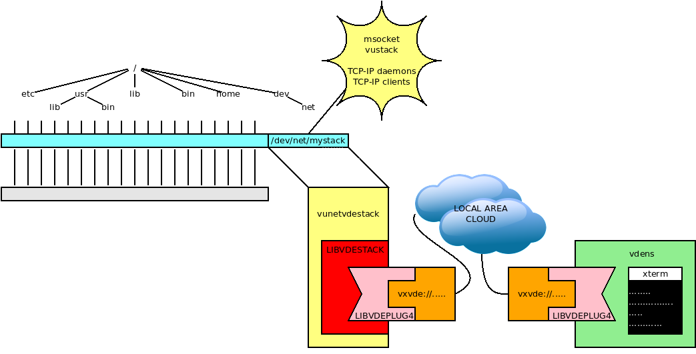

`vunet`: VUOS virtual networking
====

`vunet` is the module to support virtual network stacks.


VUOS uses the `mount` operation to load virtual stacks, too.

A network stack appear as a special file, it can be unloaded using `vuumount`,
it is possbile to select the stack using the command `vustack`.

## vunetvdestack: a joining link between VUOS and VDE

The example we are going to build connects a VUOS session to a
`vdens` using `vxvde`. Here is a graphical sketch of the
virtual architecture of this example.




In a VUOS window let us load the `vuet` module and then _mount~ a new TCP-IP
stack (provided by libvdestack) as `/dev/net/mysstack.

```
$$ vu_insmod vunet
$$ vumount -t vunetvdestack vxvde://234.0.0.1 /dev/net/mystack
```

The command `vustack` gives access to the new stack.

```
$$ vustack /dev/net/mystack ip addr
1: lo: <LOOPBACK> mtu 65536 qdisc noop state DOWN group default qlen 1000
    link/loopback 00:00:00:00:00:00 brd 00:00:00:00:00:00
2: vde0: <BROADCAST,MULTICAST> mtu 1500 qdisc noop state DOWN group default qlen 1000
    link/ether 8e:a6:fd:a1:db:38 brd ff:ff:ff:ff:ff:ff
$$
```

It is possible to _mount_ several stacks and `vustack` permits to decide which one
to use for a command.

The stack provided by the linux kernel is still available:
```
$$ ip link
1: lo: <LOOPBACK,UP,LOWER_UP> mtu 65536 qdisc noqueue state UNKNOWN mode DEFAULT group default qlen 1000
    link/loopback 00:00:00:00:00:00 brd 00:00:00:00:00:00
2: ens3: <BROADCAST,MULTICAST,UP,LOWER_UP> mtu 1500 qdisc pfifo_fast state UP mode DEFAULT group default qlen 1000
    link/ether 52:54:00:12:34:56 brd ff:ff:ff:ff:ff:ff
    altname enp0s3
```

The command
```
$$ vustack /dev/net/mystack bash
```
starts a new stack using `/dev/net/mystack` as default network.

Let us configure the new stack:
```
$$ ip addr add 10.0.0.70/24 dev vde0
$$ ip addr add fc00::1:70/64 dev vde0
$$ ip link set vde0 up
```

Using another terminal window on the hosting system (not a VUOS session) start
and configure a vdens session.
```
$ vdens vxvde://234.0.0.1
$# ip addr add 10.0.0.1/24 dev vde0
$# ip addr add fc00::1:1/64 dev vde0
$# ip link set vde0 up
```

Now it is possible to test the reachability using ping, e.g. from the `vdens` session:
```
$# ping -c 2 10.0.0.70
PING 10.0.0.70 (10.0.0.70) 56(84) bytes of data.
64 bytes from 10.0.0.70: icmp_seq=1 ttl=64 time=0.974 ms
64 bytes from 10.0.0.70: icmp_seq=2 ttl=64 time=0.368 ms

--- 10.0.0.70 ping statistics ---
2 packets transmitted, 2 received, 0% packet loss, time 1001ms
rtt min/avg/max/mdev = 0.368/0.671/0.974/0.303 ms
$# ping -c 2 fc00::1:70
PING fc00::1:70(fc00::1:70) 56 data bytes
64 bytes from fc00::1:70: icmp_seq=1 ttl=64 time=0.492 ms
64 bytes from fc00::1:70: icmp_seq=2 ttl=64 time=0.335 ms

--- fc00::1:70 ping statistics ---
2 packets transmitted, 2 received, 0% packet loss, time 1021ms
rtt min/avg/max/mdev = 0.335/0.413/0.492/0.078 ms
```

Netcat (`nc`) can be used to test a TCP connection.
e.g. let us put the server on the `vdens` session:
```
$# nc -6 -l -p 7000
```
Now from VUOS start the client using IPV4:
```
$$ nc 10.0.0.1 7000
```
op IPv6
```
$$ nc fc00::1:1 7000
```

What is typed in a window appears in the other and vice-versa.


## Disable the networking: vdenetnull

We need to load the module (if not already loaded) and mount the `vunetnull`
stack:
```
$$ vu_insmod vunet
$$ vumount -t vunetnull none /dev/net/null
```
Now we start a shell using the `null` stack using `exec` so that it is not possible
to return back to the calling shell.
```
$$ exec vustack /dev/net/null bash
$$ ip addr
Cannot open netlink socket: Address family not supported by protocol
```

This is just an example to show the effects of `vunet` mounts.
If you need a safe environment to deny access to networking please refer to
[libpam-net](https://github.com/rd235/libpam-net), another VirtualSquare project.
