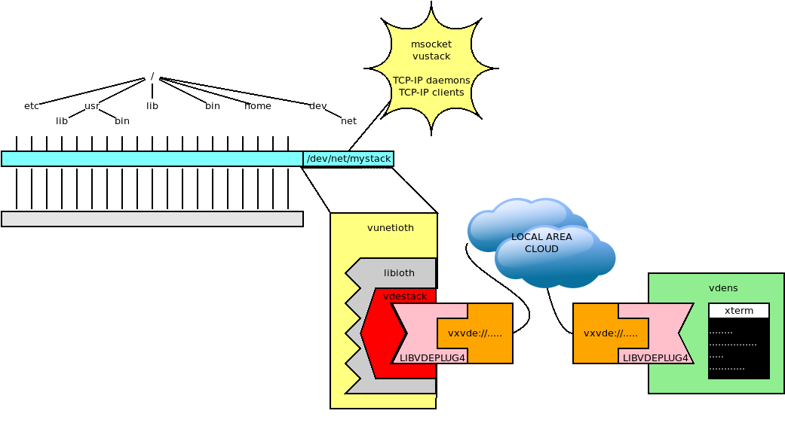
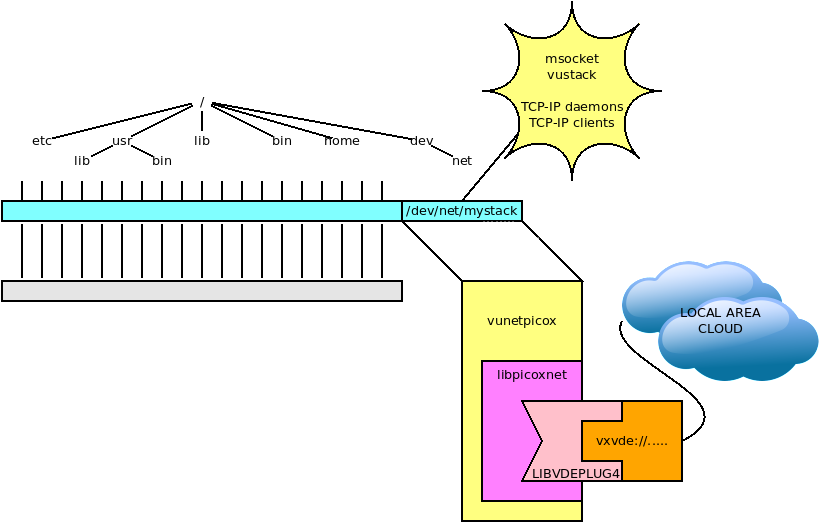

`vunet`: VUOS virtual networking
====

`vunet` is the module to support virtual network stacks.


VUOS uses the `mount` operation to load virtual stacks, too.

A network stack appear as a special file, it can be unloaded using `vuumount`,
it is possbile to select the stack using the command `vustack`.

## vunetioth: a unified solution for VUOS virtual networking

The example we are going to build connects a VUOS session to a
`vdens` using `vxvde` and the stack vdestack (or any other stack supported
by libioth, just change the string `vdestack` to something else e.g. `picox`).
Here is a graphical sketch of the virtual architecture of this example.



In a VUOS window let us load the `vunet` module and then _mount_ a new TCP-IP
stack (provided by libvdestack) as `/dev/net/mystack`.

```
$$ vu_insmod vunet
$$ vumount -t vunetioth -o vxvde://234.0.0.1 vdestack /dev/net/mystack
```

The command `vustack` gives access to the new stack.

```
$$ vustack /dev/net/mystack ip addr
1: lo: <LOOPBACK> mtu 65536 qdisc noop state DOWN group default qlen 1000
    link/loopback 00:00:00:00:00:00 brd 00:00:00:00:00:00
2: vde0: <BROADCAST,MULTICAST> mtu 1500 qdisc noop state DOWN group default qlen 1000
    link/ether 8e:a6:fd:a1:db:38 brd ff:ff:ff:ff:ff:ff
$$
```

It is possible to _mount_ several stacks and `vustack` permits to decide which one
to use for a command.

The stack provided by the linux kernel is still available:
```
$$ ip link
1: lo: <LOOPBACK,UP,LOWER_UP> mtu 65536 qdisc noqueue state UNKNOWN mode DEFAULT group default qlen 1000
    link/loopback 00:00:00:00:00:00 brd 00:00:00:00:00:00
2: ens3: <BROADCAST,MULTICAST,UP,LOWER_UP> mtu 1500 qdisc pfifo_fast state UP mode DEFAULT group default qlen 1000
    link/ether 52:54:00:12:34:56 brd ff:ff:ff:ff:ff:ff
    altname enp0s3
```

The command
```
$$ vustack /dev/net/mystack bash
```
starts a new shell (bash) using `/dev/net/mystack` as default network.

Let us configure the new stack:
```
$$ ip addr add 10.0.0.70/24 dev vde0
$$ ip addr add fc00::1:70/64 dev vde0
$$ ip link set vde0 up
```

Using another terminal window on the hosting system (not a VUOS session) start
and configure a vdens session.
```
$ vdens vxvde://234.0.0.1
$# ip addr add 10.0.0.1/24 dev vde0
$# ip addr add fc00::1:1/64 dev vde0
$# ip link set vde0 up
```

Now it is possible to test the reachability using ping, e.g. from the `vdens` session:
```
$# ping -c 2 10.0.0.70
PING 10.0.0.70 (10.0.0.70) 56(84) bytes of data.
64 bytes from 10.0.0.70: icmp_seq=1 ttl=64 time=0.974 ms
64 bytes from 10.0.0.70: icmp_seq=2 ttl=64 time=0.368 ms

--- 10.0.0.70 ping statistics ---
2 packets transmitted, 2 received, 0% packet loss, time 1001ms
rtt min/avg/max/mdev = 0.368/0.671/0.974/0.303 ms
$# ping -c 2 fc00::1:70
PING fc00::1:70(fc00::1:70) 56 data bytes
64 bytes from fc00::1:70: icmp_seq=1 ttl=64 time=0.492 ms
64 bytes from fc00::1:70: icmp_seq=2 ttl=64 time=0.335 ms

--- fc00::1:70 ping statistics ---
2 packets transmitted, 2 received, 0% packet loss, time 1021ms
rtt min/avg/max/mdev = 0.335/0.413/0.492/0.078 ms
```

Netcat (`nc`) can be used to test a TCP connection.
e.g. let us put the server on the `vdens` session:
```
$# nc -6 -l -p 7000
```
Now from VUOS start the client using IPV4:
```
$$ nc 10.0.0.1 7000
```
op IPv6
```
$$ nc fc00::1:1 7000
```

What is typed in a window appears in the other and vice-versa.

## iplink: add/delete vunetioth interfaces

`iplink` allow users to add or delete interfaces whose types are not supported by `ip-link`(8).
In fact iproute's `ip link` tool supports many types of interfaces (36 at the time of writing), and it generates a
netlink request even when the type is not officially supported, but there is no way to send configuration parameters
to set up a new interface.

So for example in a `umvu` session, using a `vunetioth` stack the command:
```
$$ ip link add vde1 type vde
```
creates a vde interface connected to the default VDE network (or pre-defined net as set in `~/.vdeplug/default`).

The command `iplink` has syntax inspired by `ip link` but is support a `data` option:

```
$$ iplink add vde1 type vde data vxvde://234.0.0.1
$$ iplink add vde2 type vde data slirp://
```

Note: For the interested readers, `iplink` uses the `IFLA_LINKINFO` option and
its `IFLA_INFO_KIND` sub-option to define the type of the interface (exactly as
`ip link` does). `iplink` can add the `IFLA_INFO_SLAVE_KIND` sub-option to send the configuration options.

## vunetvdestack: a joining link between VUOS and VDE

The example we are going to build connects a VUOS session to a
`vdens` using `vxvde`. `vunetvdestack` is the vunet specific module
for `vdestack`: this example provides the same service as the example above
using `vunetioth` and `iothvdestack`.

Here is a graphical sketch of the virtual architecture of this example.


In a VUOS window let us load the `vunet` module and then _mount_ a new TCP-IP
stack (provided by libvdestack) as `/dev/net/mystack`.

```
$$ vu_insmod vunet
$$ vumount -t vunetvdestack vxvde://234.0.0.1 /dev/net/mystack
```

The command `vustack` gives access to the new stack.

```
$$ vustack /dev/net/mystack ip addr
1: lo: <LOOPBACK> mtu 65536 qdisc noop state DOWN group default qlen 1000
    link/loopback 00:00:00:00:00:00 brd 00:00:00:00:00:00
2: vde0: <BROADCAST,MULTICAST> mtu 1500 qdisc noop state DOWN group default qlen 1000
    link/ether 8e:a6:fd:a1:db:38 brd ff:ff:ff:ff:ff:ff
$$
```

It is possible to _mount_ several stacks and `vustack` permits to decide which one
to use for a command.

The stack provided by the linux kernel is still available:
```
$$ ip link
1: lo: <LOOPBACK,UP,LOWER_UP> mtu 65536 qdisc noqueue state UNKNOWN mode DEFAULT group default qlen 1000
    link/loopback 00:00:00:00:00:00 brd 00:00:00:00:00:00
2: ens3: <BROADCAST,MULTICAST,UP,LOWER_UP> mtu 1500 qdisc pfifo_fast state UP mode DEFAULT group default qlen 1000
    link/ether 52:54:00:12:34:56 brd ff:ff:ff:ff:ff:ff
    altname enp0s3
```

The command
```
$$ vustack /dev/net/mystack bash
```
starts a new shell (bash) using `/dev/net/mystack` as default network.

Let us configure the new stack:
```
$$ ip addr add 10.0.0.70/24 dev vde0
$$ ip addr add fc00::1:70/64 dev vde0
$$ ip link set vde0 up
```

Using another terminal window on the hosting system (not a VUOS session) start
and configure a vdens session.
```
$ vdens vxvde://234.0.0.1
$# ip addr add 10.0.0.1/24 dev vde0
$# ip addr add fc00::1:1/64 dev vde0
$# ip link set vde0 up
```

Now it is possible to test the reachability using ping, e.g. from the `vdens` session:
```
$# ping -c 2 10.0.0.70
PING 10.0.0.70 (10.0.0.70) 56(84) bytes of data.
64 bytes from 10.0.0.70: icmp_seq=1 ttl=64 time=0.974 ms
64 bytes from 10.0.0.70: icmp_seq=2 ttl=64 time=0.368 ms

--- 10.0.0.70 ping statistics ---
2 packets transmitted, 2 received, 0% packet loss, time 1001ms
rtt min/avg/max/mdev = 0.368/0.671/0.974/0.303 ms
$# ping -c 2 fc00::1:70
PING fc00::1:70(fc00::1:70) 56 data bytes
64 bytes from fc00::1:70: icmp_seq=1 ttl=64 time=0.492 ms
64 bytes from fc00::1:70: icmp_seq=2 ttl=64 time=0.335 ms

--- fc00::1:70 ping statistics ---
2 packets transmitted, 2 received, 0% packet loss, time 1021ms
rtt min/avg/max/mdev = 0.335/0.413/0.492/0.078 ms
```

Netcat (`nc`) can be used to test a TCP connection.
e.g. let us put the server on the `vdens` session:
```
$# nc -6 -l -p 7000
```
Now from VUOS start the client using IPV4:
```
$$ nc 10.0.0.1 7000
```
op IPv6
```
$$ nc fc00::1:1 7000
```

What is typed in a window appears in the other and vice-versa.

## vunetpicox: a stack entirely in user space



`vunetpicox` can be used in place of `vunetvdestack`: the former uses a stack entirely implemented
in usr space (`picoxnet`) while the latter uses the implementation of the TCP-IP stack of Linux
(through the definition of a namespace).

From the user interface point of view there are only marginal differences.

Ina VUOS window let us load `vunet` and  _mount_ a `vunetpicox` stack as `/dev/net/picox`.
```
$$ vu_insmod vunet
$$ vumount -t vunetpicox vxvde://234.0.0.1 /dev/net/picox
```

Note: This module is giong to be deprecated. `picoxnet` can be loaded as a plugin of the more
general `vunetioth` module. The mount command is `vumount -t vunetioth -o vxvde://234.0.0.1 picox /dev/net/picox`

Let us start a _bash_ shell using `/dev/net/pixox` as default network and configure our new net:
```
$$ vustack /dev/net/picox bash
$$ ip addr add 10.0.0.80/24 dev vde0
$$ ip addr add fc00::1:80/64 dev vde0
$$ ip link set vde0 up
$$ ip addr
2090479455: loop: <UP> mtu 1500
    link/netrom 00:00:00:00:00:00 brd ff:ff:ff:ff:ff:ff
    inet6 ::1/128 scope host dynamic loop
2090826452: vde0: <UP> mtu 1500
    link/netrom 80:00:40:79:ef:22 brd ff:ff:ff:ff:ff:ff
    inet 10.0.0.80/24 scope global dynamic vde0
    inet6 fc00::1:80/64 scope global dynamic vde0
    inet6 fe80::8200:40ff:fe79:ef22/64 scope link dynamic vde0
```

Note: `picoxnet` uses large integers as interface identifiers. It is not an error.

Using another terminal window on the hosting system (not a VUOS session) start and configure a vdens session.

```
$ vdens vxvde://234.0.0.1
$# ip addr add 10.0.0.1/24 dev vde0
$# ip addr add fc00::1:1/64 dev vde0
$# ip link set vde0 up
```

Now it is possible to test the reachability using ping, e.g. from the vdens session:
```
$# ping -c 2 10.0.0.80
PING 10.0.0.80 (10.0.0.80) 56(84) bytes of data.
64 bytes from 10.0.0.80: icmp_seq=1 ttl=64 time=3.32 ms
64 bytes from 10.0.0.80: icmp_seq=2 ttl=64 time=1.93 ms

--- 10.0.0.80 ping statistics ---
2 packets transmitted, 2 received, 0% packet loss, time 1002ms
rtt min/avg/max/mdev = 1.926/2.621/3.317/0.695 ms
$# ping -c 2 fc00::1:80
PING fc00::1:80(fc00::1:80) 56 data bytes
64 bytes from fc00::1:80: icmp_seq=1 ttl=64 time=3.30 ms
64 bytes from fc00::1:80: icmp_seq=2 ttl=64 time=2.41 ms

--- fc00::1:80 ping statistics ---
2 packets transmitted, 2 received, 0% packet loss, time 1002ms
rtt min/avg/max/mdev = 2.414/2.858/3.302/0.444 ms
```

Netcat can be used to test connections.

Warning: picoxnet handles IPv4 and IPv6 as independent stacks. So an IPv6 `bind` or `connect` does __not__ manage IPv4
services.

Note: `iplink` command described above can be used to add/delete interfaces for `vunetpicox`.

## Disable the networking: vdenetnull

We need to load the module (if not already loaded) and mount the `vunetnull`
stack:
```
$$ vu_insmod vunet
$$ vumount -t vunetnull none /dev/net/null
```
Now we start a shell using the `null` stack using `exec` so that it is not possible
to return back to the calling shell.
```
$$ exec vustack /dev/net/null bash
$$ ip addr
Cannot open netlink socket: Address family not supported by protocol
```

This is just an example to show the effects of `vunet` mounts.
If you need a safe environment to deny access to networking please refer to
[libpam-net](https://github.com/rd235/libpam-net), another VirtualSquare project.

Note:  we are developing the support for other user-level implemented stacks.
A `vufs` module for
[picotcp-ng](https://gitlab.com/insane-adding-machines/picotcp) should be released soon.
