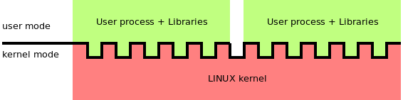
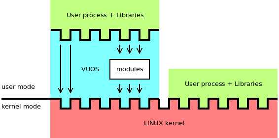
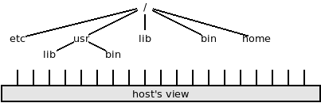
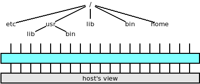
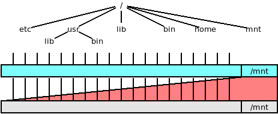
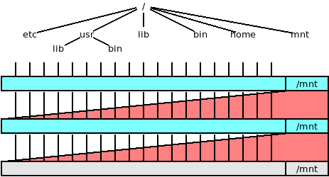

VUOS/umvu basic concepts
====

VUOS is a modular, configurable and Linux compatible operating system kernel
running as a user program on GNU/Linux hosts.

VUOS is a different perspective on namespaces, anykernels and related concepts.
The main idea behind VUOS is that it is possible to give processes their own
"view" using partial virtual machines.






A partial virtual machine intercepts the system call requests and operates like
a filter: system call can be forwarded to the kernel of the hosting system or
processed by the partial virtual machine hypervisor.

In this way processes can see a mix of resources provided by the kernel (on
which they have the same view of the other processes) and virtual resource.
It is possible to mount file systems, load networking stack, change the
structure of the file system tree, create virtual devices.

The hypervisor is just a user process so while it gives new perspective for
processes, __it does not widen the attack surface of the kernel__.

`umvu` is a VOUS hypervisor (based on ptrace and bpf-seccomp).

## first steps in VUOS

The command line to start `umvu` requires a command (and its argument).

For example, this command:

```bash
$ umvu bash
$
```
starts the hypervisor and a `bash` controlled by the hypervisor.
If you are using the [virtual machine](setup_the_vm.md) for this tutorial
the prompts will be like:
```bash
user@V2-20200620-303:~$ umvu bash
user@V2-20200620-303[722]:~$
```

The number in square brackets is the pid of the hypervisor. It permits to
discover from the promt which shell prompts are waiting for commands for the hosting system
and which for a VUOS session.

Hint: Append the contents of 
[this file](https://raw.githubusercontent.com/virtualsquare/virtualsquare.github.io/master/archive/install_scripts/append_to.bashrc) 
at the end of your `.bashrc` file to get a prompt
including the hypervisor's pid, and the list of currently granted capabilities.

Another convenient way to start `umvu` for those who are using the [virtual machine](setup_the_vm.md)
for this tutorial consists of the activation of an xterm session. From a terminal session of the hosting computer
run:
```bash
$ ssh -p 2222 -X user@localhost umvu xterm
user@localhost's password:
```
As soon as the correct password has been typed in, an xterm window appears. This xterm is running in the VM
and it is under the control of a VUOS hypervisor. This latter method permits to run programs using X-window GUIs. Moreover
the feedback messages of the hypervisor (errors or debug messages) is printed on one terminal (the one of the hosting computer)
while the standard output of the programs running in VUOS appears on the other window.

Note: if you have installed `umvu` on a Linux host and using a graphical session (like gnome or kde) it is possible
to get the same _separation of output_ using the command `umvu xterm`.

Note: In the following examples we'll use `$$` as the prompt of a shell under the VUOS hypervisor control.
(as if the user has set `PS1='\$\$ '`

At this point the hypervisor is ready to provide processes with their own _views_ but it requires to load _modules_ and to mount
_submodules_ in order to configure the requested services. In other words, the hypervisor has been interposed but it transparently forwards 
all the system calls to the kernel, so the processes running under the hypervisor control have the same _view_.

This is the _view_ for a process running directly on the hosting system:



This picture depicts the situation for a process running under `umvu`'s control:



## VUOS modules

Each VUOS module enables a kind of virtualization. In fact modules implement the core common part required to implement a virtual view
of a specific type.

Examples of modules include:

* `vufs`: file system _patchworking_. Move, hide, give copy-on-write access, merge file, directories and file system subtrees.

* `vufuse`: VUOS implementation of file system in userspace. Mount file system images.

* `vudev`: create virtual devices

* `vunet`: network virtualization

* `unreadiudgid`: permit virtual seuid/setgid

The command to add a module is `vu_insmod`. e.g.:

```bash
$$ vu_insmod vufs
$$ vu_lsmod
vufs: vu filesystem patchworking
$$
```

`vu_lsmod` lists the currently loaded modules and `vu_rmmod` deletes a module (removal is forbidden if the module is in use).
Please refer to the [man pages](/man/index.md) for the a detailed description of these commands.

## VUOS submodules

Submodules implement specific virtualizations of the type defined by their modules. Submodules name have the name of their module syllabus
as a prefix. Some examples follow:

* `vufuseext2` is the module of `vufuse` that supports the mounting of ext2/3/4 file systems.

* `vudevpartx` is the module of `vudev` to mount a disk image and create virtual devices for its partitions.

Submodules are specified as types (option `-t`) in the __mount__(8) command
Some modules do not have submodules.

## The role of the "mount" operation

Pathnames play a central role in UNIX. It is a key design choice since the very first versions. Devices can be named as special files
(`/dev/`), communication channels between processes (socket family `AF_UNIX`) can be named by a pathname. In Linux there  are subtrees of the
file system whose _files_ permit to read or configure the status of the devices, parameters of the kernel or of the running processes 
(`/proc` and `sys`).
So, the filesystem tree it is not just a way to access each individual file, it is a global naming tool.

Following this rule VUOS uses the `mount`(2) system call, as well as the `mount`(8) command (and their counterpart `umount`) to
activate a specific virtualization. Each mounted service can be seen as a layer that modifies the _view_ of the processes.

VUOS uses `mount` to mount file systems (as in `vufuse`), to name networking stacks (`vunet`), to provide a means for the configuration
of the virtual service (e.g. `vumisc` or `vubinfmt`).

Attention: Rule-of-thumb: use `vumount` and `vuumount` instead of `mount` and `umount` in VUOS. It is simpler.
Explanation: the `mount` command performs [useless security checks](/vbetter/freemount.md). When the command is executed by a
unprivileged user it fails and it does not try to call the `mount` system call. So that command cannot be used to
for a mount operation that the kernel permits for unprivileged users.
`mount`(8) __does__ work in VUOS, but it needs to virtualize the uid of the calling process (a VUOS implementation of `fakeroot`).
The commands `vumount` and `vuumount` have been designed to provide a direct access to the `mount` and `unmount` system calls.
`vumount` is _not_ a setuid command, if a user tries an operation restricted to root (or owners of `CAP_SYS_ADMIN`) the system call
will return an error. 

## A simple example

After `umvu` has started and the `vufs` module has been loaded (as explained in the previous sections), the hypervisor is _transparent_,
it provides an unmodified view of the system, including the file system. So the `/mnt` directory is empty.

```bash
$$ ls /mnt
$$
```

The default action of the `vufs` module is to _clone_ the view a file or a directory at a specific path. `vumount -t vufs /a/b/c /d/e/f` 
would mean show the contents of a/b/c also as d/e/f.
Let us use the `vufs` module to mount `/` as `/mnt`.

```bash
$$ vu_insmod vufs
$$ vumount -t vufs / /mnt
$$ ls /mnt
bin   dev  home  lib32  libx32      media  opt   root  sbin  sys  usr
boot  etc  lib   lib64  lost+found  mnt    proc  run   srv   tmp  var
$$ ls /
bin   dev  home  lib32  libx32      media  opt   root  sbin  sys  usr
boot  etc  lib   lib64  lost+found  mnt    proc  run   srv   tmp  var
$$
```

The entire file system tree is virtually _replicated_ inside `/mnt`. 
This picture here below is a graphical representation of the VUOS status:



`/mnt/mnt` is `/mnt` of the original file tree, so it is empty.

```bash
$$ ls /mnt/mnt
$$
```

VUOS supports nested, layered virtualization. So, if we repeat the mount operation
it will be possible to access the entire file system as `/mnt/mnt` too (and `/mnt/mnt/mnt`
will be empty).

```bash
$$ vumount -t vufs / /mnt
$$ ls /mnt/mnt
bin   dev  home  lib32  libx32      media  opt   root  sbin  sys  usr
boot  etc  lib   lib64  lost+found  mnt    proc  run   srv   tmp  var
$$ ls /mnt/mnt/mnt
$$
```

Graphically:



Note: the second mount is the one appearing at the top. So a pathname like `/mnt/etc/passwd`
is provided by the second mount operation while in `/mnt/mnt/etc/passwd` by the first.
(more exactly the second/latest layer of virtualization operates first and given that it refers
 to `/mnt` it forwards the request the the first layer, deleting the heading '/etc' from the pathname).

Note: In VUOS the directory of the mount-point must exist but the actual mount-point might not exist.
The mount-point is accessible by a (absolute or relative) pathname, but it does not appear
in the directory list.

This is an example regarding the note here above;

```bash
$$ ls /unreal
ls: cannot access '/unreal': No such file or directory
$$ vumount -t vufs / /unreal
$$ ls /unreal
bin   dev  home  lib32  libx32      media  opt   root  sbin  sys  usr
boot  etc  lib   lib64  lost+found  mnt    proc  run   srv   tmp  var
$$ ls /
bin   dev  home  lib32  libx32      media  opt   root  sbin  sys  usr
boot  etc  lib   lib64  lost+found  mnt    proc  run   srv   tmp  var
$$ ls -d /unreal
/unreal
$$ cd /
$$ ls -d unreal
unreal
$$ 
```

The mount-point `/unreal` exists and the mounted subtree can be reached using 
any kind of pathname but the directory list of `/` does not include `unreal`.

Note: In VUOS a mount-point can be a file. It is possible in this way to change the
contents of a file or to add a file.

```bash
$$ cat /etc/resolv.conf
nameserver 10.0.2.3
$$ echo nameserver 80.80.80.80 > /tmp/resolv.conf
$$ vumount -t vufs /tmp/resolv.conf /etc/resolv.conf
$$ cat /etc/resolv.conf
nameserver 80.80.80.80
$$
```

Hint: It is possible to add files or file system trees so that they appear in the
directory lists by mounting the directory and using the `vufs` option `merge`.

